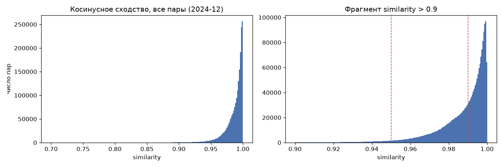

# 04. Экономическая сеть, 2024-12

Сгенерировано `src/04_economic_network.py`. Косинусное сходство по 5 долям (share_Продовольствие, share_Здоровье, share_Общепит, share_Транспорт, share_Маркетплейсы).

- МО: **2004**, всех неупорядоченных пар: **2,007,006**
- рёбер с similarity > 0.9: **2,002,208** (99.8% всех пар) → `data/processed/economic_network_2024_12.parquet` (каждая пара один раз, x < y)

## Распределение similarity по всем парам

|   квантиль |   similarity |
|-----------:|-------------:|
|     0.0000 |       0.6995 |
|     0.0100 |       0.9300 |
|     0.0500 |       0.9598 |
|     0.1000 |       0.9700 |
|     0.2500 |       0.9825 |
|     0.5000 |       0.9921 |
|     0.7500 |       0.9970 |
|     0.9000 |       0.9988 |
|     0.9500 |       0.9993 |
|     0.9900 |       0.9998 |
|     1.0000 |       1.0000 |

| интервал similarity   |          пар |   доля пар |
|:----------------------|-------------:|-----------:|
| (-1e-09, 0.5]         |       0.0000 |     0.0000 |
| (0.5, 0.8]            |      89.0000 |     0.0000 |
| (0.8, 0.9]            |   4,709.0000 |     0.0023 |
| (0.9, 0.95]           |  52,082.0000 |     0.0260 |
| (0.95, 0.97]          | 143,293.0000 |     0.0714 |
| (0.97, 0.98]          | 213,310.0000 |     0.1063 |
| (0.98, 0.99]          | 443,562.0000 |     0.2210 |
| (0.99, 0.995]         | 403,831.0000 |     0.2012 |
| (0.995, 0.999]        | 585,314.0000 |     0.2916 |
| (0.999, 1.0]          | 160,816.0000 |     0.0801 |

## Порог → размер сети

|   порог |          рёбер |   плотность |   степень медиана |   степень мин |   изолированных МО |
|--------:|---------------:|------------:|------------------:|--------------:|-------------------:|
|  0.9000 | 2,002,208.0000 |      0.9976 |        2,002.0000 |    1,405.0000 |             0.0000 |
|  0.9500 | 1,950,126.0000 |      0.9717 |        1,979.0000 |      222.0000 |             0.0000 |
|  0.9700 | 1,806,833.0000 |      0.9003 |        1,894.0000 |       46.0000 |             0.0000 |
|  0.9800 | 1,593,523.0000 |      0.7940 |        1,743.0000 |       15.0000 |             0.0000 |
|  0.9900 | 1,149,961.0000 |      0.5730 |        1,328.0000 |        5.0000 |             0.0000 |
|  0.9950 |   746,130.0000 |      0.3718 |          839.0000 |        0.0000 |             1.0000 |
|  0.9990 |   160,816.0000 |      0.0801 |          133.0000 |        0.0000 |            27.0000 |
