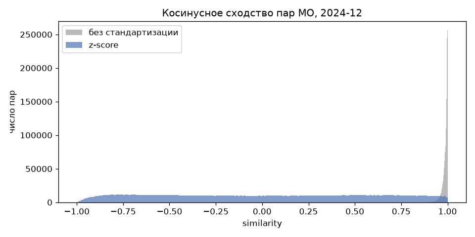

# 05. Экономическая сеть 2024-12: z-score + cosine + kNN (k=8)

Сгенерировано `src/05_economic_network_std_knn.py`.

Средние и std долей, использованные для z-score:

|                      |   mean |    std |
|:---------------------|-------:|-------:|
| share_Продовольствие | 0.4154 | 0.0594 |
| share_Здоровье       | 0.0424 | 0.0077 |
| share_Общепит        | 0.0279 | 0.0203 |
| share_Транспорт      | 0.0500 | 0.0127 |
| share_Маркетплейсы   | 0.1938 | 0.0399 |

## Квантили similarity по всем парам

|   квантиль |   без стандартизации |   z-score |
|-----------:|---------------------:|----------:|
|     0.0000 |               0.6995 |   -0.9997 |
|     0.0100 |               0.9300 |   -0.9437 |
|     0.1000 |               0.9700 |   -0.7654 |
|     0.2500 |               0.9825 |   -0.4934 |
|     0.5000 |               0.9921 |    0.0087 |
|     0.7500 |               0.9970 |    0.5040 |
|     0.9000 |               0.9988 |    0.7905 |
|     1.0000 |               1.0000 |    0.9999 |

## kNN-граф (k=8, объединение x→y и y→x)

| метрика                      |    значение |
|:-----------------------------|------------:|
| узлов                        |  2,004.0000 |
| рёбер                        | 10,425.0000 |
| из них взаимных (mutual)     |  5,607.0000 |
| плотность                    |      0.0052 |
| изолированных МО             |      0.0000 |
| компонент связности          |      1.0000 |
| размер крупнейшей компоненты |  2,004.0000 |
| степень min                  |      8.0000 |
| степень медиана              |     10.0000 |
| степень max                  |     19.0000 |
| similarity ребра min         |      0.6583 |
| similarity ребра медиана     |      0.9737 |

- edge list: `data/processed/economic_network_2024_12_std_knn8.parquet` (territory_id_x < territory_id_y, similarity, mutual)
- граф: `data/processed/economic_network_2024_12_std_knn8.graphml` (атрибуты рёбер similarity, mutual)
