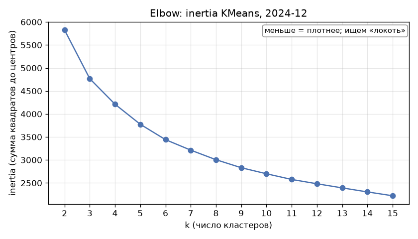
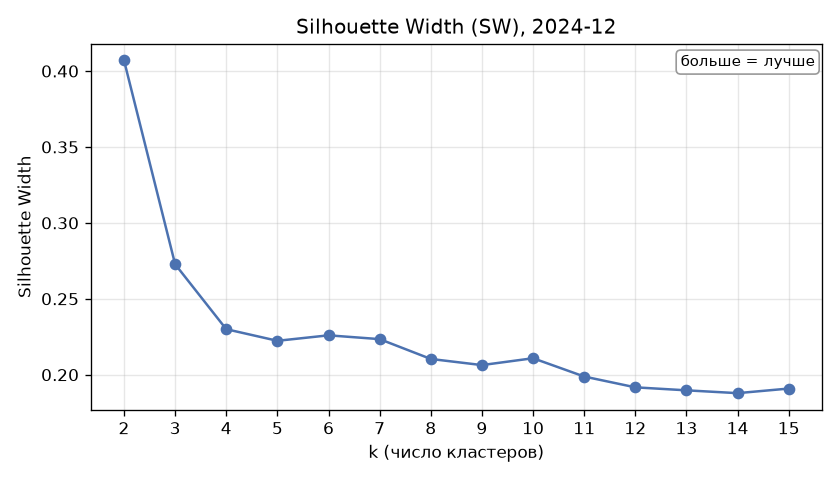
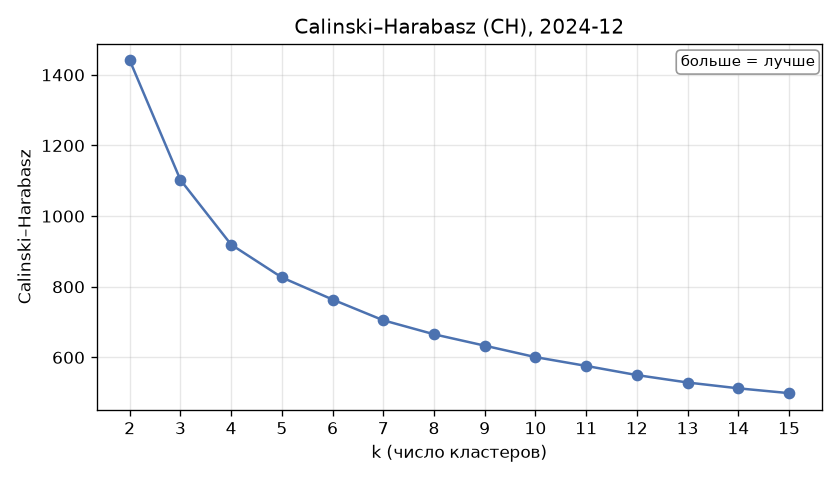
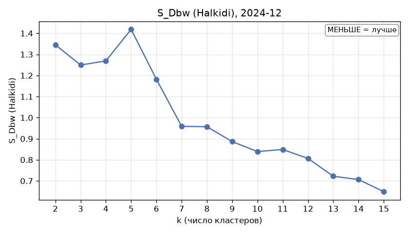
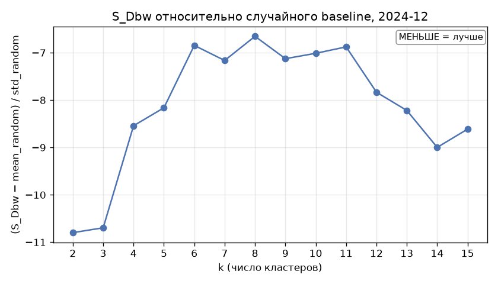

# 10. Выбор k для KMeans (2024-12)

Сгенерировано `src/10_kmeans_k_selection.py`. **Итоговое k не выбирается** — таблица и графики для ручного решения.

- Признаки: 5 долей (share_Продовольствие, share_Здоровье, share_Общепит, share_Транспорт, share_Маркетплейсы), z-score внутри месяца — та же стандартизация, что для экономической сети; МО: **2004**
- KMeans: random_state=42, n_init=10; k = 2..15
- S_Dbw: пакет `s-dbw`, {'method': 'Halkidi', 'centr': 'mean', 'nearest_centr': True, 'metric': 'euclidean'}. Центр кластера — ближайшая к среднему точка: при центре-среднем (как буквально в статье) плотность у центров в 5-мерном пространстве бывает нулевой, и для k ≥ 9 индекс не определён. Этот вариант приведён справочно в колонке «S_Dbw (центр = среднее)» (NaN = не определён).
- **Baseline S_Dbw**: для каждого k — 100 случайных разбиений тех же МО на k групп (перестановка меток реального разбиения, размеры кластеров сохраняются), S_Dbw тем же способом; `S_Dbw norm` = (S_Dbw − mean_random) / std_random — чем отрицательнее, тем сильнее реальное разбиение лучше случайного. rng seed = 2025 + k. 95% ДИ для S_Dbw norm — бутстреп (2000 повторов) по 100 случайным значениям (неопределённость оценки mean/std baseline). Принцип (нормировать индексы, чьи случайные уровни зависят от K, на среднее и дисперсию случайного разбиения) рекомендован в Shalileh et al. (2025); сама процедура в статье не описана, авторы откладывают её. Перестановка меток с сохранением размеров кластеров и бутстреп-ДИ — наши.
- KMeans и все метрики — в евклидовой геометрии z-score признаков (экономическая сеть строилась по косинусу тех же признаков).

Направление метрик: inertia — ищем «локоть»; **SW ↑, CH ↑ — больше лучше; S_Dbw ↓ — меньше лучше.**

|       k |    inertia |     SW |         CH |   S_Dbw |   S_Dbw random mean |   S_Dbw random std |   S_Dbw norm |   S_Dbw norm 95% ДИ: низ |   S_Dbw norm 95% ДИ: верх |   S_Dbw (центр = среднее) |   мин. размер кластера |   макс. размер кластера |
|--------:|-----------:|-------:|-----------:|--------:|--------------------:|-------------------:|-------------:|-------------------------:|--------------------------:|--------------------------:|-----------------------:|------------------------:|
|  2.0000 | 5,825.6998 | 0.4071 | 1,441.3700 |  1.3456 |              2.4314 |             0.1006 |     -10.7978 |                 -12.4117 |                   -9.5559 |                    1.3634 |               560.0000 |              1,444.0000 |
|  3.0000 | 4,766.8068 | 0.2728 | 1,102.5890 |  1.2496 |              2.6202 |             0.1282 |     -10.6954 |                 -12.1366 |                   -9.6460 |                    1.1480 |               414.0000 |                959.0000 |
|  4.0000 | 4,211.7497 | 0.2300 |   919.3725 |  1.2691 |              2.7637 |             0.1750 |      -8.5414 |                  -9.8548 |                   -7.6601 |                    1.2129 |               341.0000 |                641.0000 |
|  5.0000 | 3,776.1408 | 0.2223 |   826.3380 |  1.4186 |              2.9078 |             0.1825 |      -8.1619 |                  -9.7177 |                   -7.2283 |                    1.3943 |               330.0000 |                443.0000 |
|  6.0000 | 3,441.4948 | 0.2259 |   763.8606 |  1.1818 |              2.7608 |             0.2307 |      -6.8451 |                  -8.3373 |                   -5.8649 |                    1.1899 |               111.0000 |                433.0000 |
|  7.0000 | 3,213.3435 | 0.2234 |   705.0352 |  0.9589 |              2.6062 |             0.2300 |      -7.1635 |                  -8.4714 |                   -6.2757 |                    1.1241 |               103.0000 |                396.0000 |
|  8.0000 | 3,005.6021 | 0.2104 |   665.4592 |  0.9568 |              2.6234 |             0.2505 |      -6.6536 |                  -7.6242 |                   -5.9725 |                    0.9032 |                99.0000 |                378.0000 |
|  9.0000 | 2,831.1455 | 0.2063 |   633.2177 |  0.8864 |              2.6799 |             0.2517 |      -7.1253 |                  -8.3035 |                   -6.3603 |                  nan      |                85.0000 |                292.0000 |
| 10.0000 | 2,699.7350 | 0.2109 |   600.7903 |  0.8392 |              2.5181 |             0.2394 |      -7.0123 |                  -8.3565 |                   -6.1573 |                  nan      |                39.0000 |                306.0000 |
| 11.0000 | 2,576.1222 | 0.1988 |   575.8907 |  0.8490 |              2.5657 |             0.2496 |      -6.8766 |                  -7.9670 |                   -6.1457 |                  nan      |                38.0000 |                255.0000 |
| 12.0000 | 2,482.2526 | 0.1917 |   549.9108 |  0.8064 |              2.4316 |             0.2075 |      -7.8338 |                  -9.4167 |                   -6.7581 |                  nan      |                32.0000 |                225.0000 |
| 13.0000 | 2,392.8099 | 0.1897 |   528.8694 |  0.7223 |              2.3841 |             0.2022 |      -8.2187 |                  -9.3967 |                   -7.4842 |                  nan      |                35.0000 |                205.0000 |
| 14.0000 | 2,304.8287 | 0.1879 |   512.4089 |  0.7061 |              2.1894 |             0.1648 |      -8.9979 |                 -10.5046 |                   -7.8836 |                  nan      |                19.0000 |                220.0000 |
| 15.0000 | 2,221.4948 | 0.1909 |   498.7384 |  0.6490 |              2.0435 |             0.1619 |      -8.6123 |                 -10.0526 |                   -7.6623 |                  nan      |                17.0000 |                227.0000 |

Таблица также сохранена: `data/processed/kmeans_k_selection_2024_12.parquet`

## Графики

### Elbow: inertia KMeans (меньше = плотнее; ищем «локоть»)

### Silhouette Width (SW) (больше = лучше)

### Calinski–Harabasz (CH) (больше = лучше)

### S_Dbw (Halkidi) (МЕНЬШЕ = лучше)

### S_Dbw относительно случайного baseline (МЕНЬШЕ = лучше)

