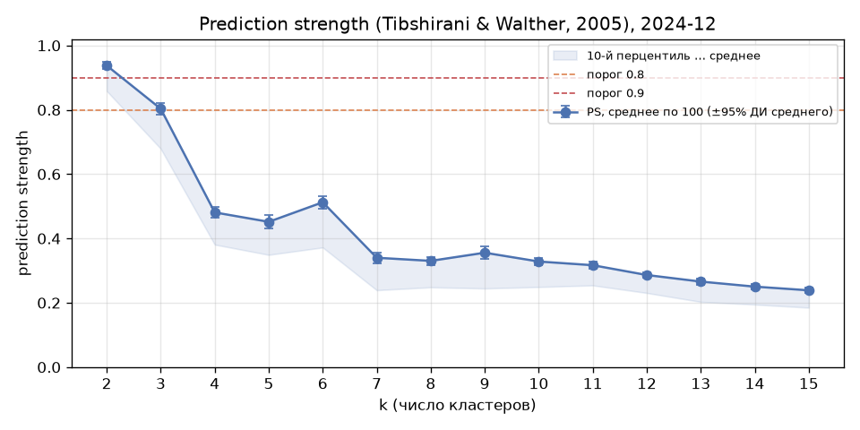

> **Историческая версия (канон KMeans k = 7), заменена 2026-09-28 решением перейти на k = 6.** Актуальная версия — файл без суффикса `_k7_superseded` (`10c_final_clustering_k6.md`).

# 10c. Итоговая кластеризация KMeans: k = 7 (2024-12)

Сгенерировано `src/10c_final_clustering_doc.py` из уже посчитанных результатов (шаги 10, 10b, 10d и 12a); кластеризация не пересчитывалась.

- **Канонические метки:** `data/processed/kmeans_labels_final.parquet` (копия `kmeans_labels_k7_2024_12.parquet`; колонки territory_id, cluster; 2004 МО). На этот файл ссылаются дальнейшие шаги (сравнение с Louvain, трекинг во времени).
- Признаки: 5 долей категорий расходов, z-score внутри месяца; KMeans random_state=42, n_init=10.

## Обоснование выбора k = 7

**Итог:** Статистические индексы (SW, CH, S_Dbw — все три с учётом известных смещений, S_Dbw — после baseline-нормализации) не выделяют единственного k: SW, CH и нормализованный S_Dbw смещены к малым k (максимум при k = 2), а кандидаты k = 6, 7, 8 по нормализованному S_Dbw статистически неразличимы между собой (95% ДИ перекрываются; с k = 7 перекрываются интервалы k = 4–15). k = 7 выбран внутри диапазона кандидатов k = 6–8 по содержательным основаниям — устойчивое появление отдельной транспортной группы и сохранение удалённой группы.

### a) Сравнение кандидатов

|   k |    SW |      CH |   CH/N |   S_Dbw |   S_Dbw mean_random |   S_Dbw std_random |   S_Dbw norm | norm 95% ДИ    |   мин. кластер |   макс. кластер | размеры кластеров                     |
|----:|------:|--------:|-------:|--------:|--------------------:|-------------------:|-------------:|:---------------|---------------:|----------------:|:--------------------------------------|
|   4 | 0.230 | 919.372 |  0.459 |   1.269 |               2.764 |              0.175 |       -8.541 | [-9.85; -7.66] |            341 |             641 | 641, 341, 528, 494                    |
|   6 | 0.226 | 763.861 |  0.381 |   1.182 |               2.761 |              0.231 |       -6.845 | [-8.34; -5.86] |            111 |             433 | 411, 396, 334, 319, 111, 433          |
|   7 | 0.223 | 705.035 |  0.352 |   0.959 |               2.606 |              0.230 |       -7.164 | [-8.47; -6.28] |            103 |             396 | 396, 297, 338, 369, 187, 314, 103     |
|   8 | 0.210 | 665.459 |  0.332 |   0.957 |               2.623 |              0.250 |       -6.654 | [-7.62; -5.97] |             99 |             378 | 294, 211, 255, 288, 99, 153, 326, 378 |

Метрики — из `10_kmeans_k_selection.md` (SW, CH ↑ — больше лучше; S_Dbw ↓ — меньше лучше; S_Dbw по методу Halkidi, центр — ближайшая к среднему точка).

- **CH/N** — индекс Калинского–Харабаза, делённый на число объектов (N = 2004), как рекомендовано в Shalileh S., Antonov E. A., Tsyplakova D. A. Cluster Validity across Attribute and Network Spaces: Empirical Benchmarks for Attributed Networks Clustering // Doklady Mathematics. 2025. Vol. 112, No. 3. P. 553–564. DOI 10.1134/S1064562425700589. При фиксированном N это лишь масштабирование: порядок кандидатов по CH/N тот же, что по CH, и выбор k не меняется; нормировка нужна для сопоставимости CH между выборками разного размера (например, между месяцами или с другими исследованиями).
- **Baseline-нормализация S_Dbw** (по тому же источнику): для каждого k — 100 случайных разбиений тех же 2004 МО на k групп (перестановка меток реального разбиения этого k, размеры кластеров сохраняются), S_Dbw тем же способом (Halkidi, nearest_centr = True). S_Dbw norm = (S_Dbw − mean_random) / std_random: чем отрицательнее, тем сильнее реальное разбиение лучше случайного. 95% ДИ — бутстреп по 100 случайным значениям (неопределённость оценки baseline). Расчёт — шаг 10.

### b) Почему SW и CH не могут быть единственным критерием

На диапазоне k = 2..15 оба индекса максимальны при k = 2 (SW = 0.407, CH = 1,441) и почти монотонно убывают с ростом k: CH падает на всём диапазоне, SW после k = 2 выходит на плато ≈ 0.22 при k = 4–7. Разбиение на 2 группы при N = 2004 МО содержательно бедно и не решает задачу типологии. Сырые значения SW и CH нельзя напрямую сравнивать между разными k: в эталонных экспериментах методологии внутренних индексов валидности (ICVI), на которую опираются критерии конкурса, даже для истинного разбиения CH резко падает с ростом K, а SW слабо снижается; кроме того, CH растёт с числом объектов N (отсюда рекомендация CH/N) — Shalileh S., Antonov E. A., Tsyplakova D. A. Cluster Validity across Attribute and Network Spaces: Empirical Benchmarks for Attributed Networks Clustering // Doklady Mathematics. 2025. Vol. 112, No. 3. P. 553–564. DOI 10.1134/S1064562425700589. Поэтому SW и CH используются как ограничение (выбранное k не должно резко ухудшать их), а не как единственный критерий; к ним добавляются S_Dbw (сырой и нормализованный, п. c) и содержательная интерпретируемость.

### c) S_Dbw: сырые значения и baseline-нормализация

S_Dbw: k=5 — 1.419 (локальный максимум), k=6 — 1.182, **k=7 — 0.959**, k=8 — 0.957. От пика при k = 5 индекс падает двумя крупнейшими на диапазоне шагами (5 → 6: −0.237; 6 → 7: −0.223); k = 7 и 8 почти равны (−0.002). При k ≥ 9 S_Dbw снова монотонно снижается (k=9 — 0.886, k=12 — 0.806, k=15 — 0.649), но одновременно появляются мелкие кластеры (с k = 10 — меньше 40 МО, при k = 14–15 — меньше 20), то есть дальнейший выигрыш достигается дроблением, а не новой структурой. Сырые значения, однако, нельзя интерпретировать без baseline.

**После baseline-нормализации выраженного перехода 6 → 7 нет.** S_Dbw norm: k=5 — -8.16, k=6 — -6.85, **k=7 — -7.16**, k=8 — -6.65, k=9 — -7.13. 95% ДИ для k = 6, 7, 8 перекрываются ([-8.34; -5.86], [-8.47; -6.28], [-7.62; -5.97]) — относительно случайного baseline эти k статистически неразличимы; k = 7 остаётся лишь номинальным локальным минимумом. Большая часть сырого падения 6 → 7 повторяется в самом baseline: среднее S_Dbw случайных разбиений снижается с 2.761 до 2.606 (69% от сырого падения 0.223), т. е. это во многом эффект числа и размеров кластеров, а не только качества структуры. Наилучшее нормализованное значение — при k = 2 (-10.80); k = 2–3 значимо лучше k = 6–11 (95% ДИ не пересекаются) — нормализованный S_Dbw, как SW и CH, смещён к малым k. **Вывод:** Статистические индексы (SW, CH, S_Dbw — все три с учётом известных смещений, S_Dbw — после baseline-нормализации) не выделяют единственного k: SW, CH и нормализованный S_Dbw смещены к малым k (максимум при k = 2), а кандидаты k = 6, 7, 8 по нормализованному S_Dbw статистически неразличимы между собой (95% ДИ перекрываются; с k = 7 перекрываются интервалы k = 4–15). k = 7 выбран внутри диапазона кандидатов k = 6–8 по содержательным основаниям — устойчивое появление отдельной транспортной группы и сохранение удалённой группы.

### d) Содержательное совпадение: обособляется транспортная группа

При k = 7 впервые выделяется компактный кластер 4 (187 МО; ↑ транспорт, ↓ здоровье): Забайкальский край — 19, Иркутская область — 17, Республика Татарстан — 14, Красноярский край — 12. При k = 6 его члены разнесены по нескольким кластерам (кластер 5: 84, кластер 1: 78, кластер 4: 13, кластер 0: 8, кластер 2: 4) — самостоятельной группы нет (наибольшее совпадение: Жаккар 0.16). При k = 8 группа сохраняется (кластер 5, 153 МО, Жаккар 0.79), т. е. это устойчивое образование, а не артефакт одного k.

### e) Почему не k = 8

- Выигрыш по S_Dbw относительно k = 7 минимален: 0.959 → 0.957 (−0.002); SW и CH при этом снижаются (0.223 → 0.210; 705 → 665).
- Добавляется кластер 6 «близко к среднему по всем категориям» (326 МО) — без отличительного профиля, малоинформативный для типологии.
- Второе изменение при k = 8 — деление столичной группы на ядро (внутригородские территории Москвы и Санкт-Петербурга) и периферию (Подмосковье, крупные города) — содержательно интересно, но может быть показано как внутренняя структура столичного кластера k = 7, не меняя основную типологию.

### f) Почему не k = 4 и не k = 6

- **k = 4:** удалённая группа (кластер 6 при k = 7, 103 МО: Республика Саха (Якутия) — 26, Сахалинская область — 16, Амурская область — 15, Хабаровский край — 10) не выделяется — её МО растворены в других кластерах (кластер 2: 81, кластер 3: 22; Жаккар с ближайшим 0.15). Теряется один из самых содержательно выраженных типов (↓ маркетплейсы −1.9σ, ↓ здоровье −1.5σ, market_access ≈ 138).
- **k = 6:** удалённая группа уже есть и близка к варианту k = 7 (кластер 4, 111 МО, общих 97, Жаккар 0.83; при k = 8 — Жаккар 0.91), поэтому аргумент против k = 6 — не она, а отсутствие транспортной группы (п. d); по статистическим индексам k = 6 и 7 неразличимы (п. c).

### g) Оговорка о принципе

Единого «правильного» числа типов территорий не существует — в том числе в специализированной литературе по типологии муниципальных образований число типов зависит от цели, набора признаков и масштаба. Выбор k = 7 обоснован не внешним эталоном. Статистические индексы (SW, CH, S_Dbw — все три с учётом известных смещений, S_Dbw — после baseline-нормализации) не выделяют единственного k: SW, CH и нормализованный S_Dbw смещены к малым k (максимум при k = 2), а кандидаты k = 6, 7, 8 по нормализованному S_Dbw статистически неразличимы между собой (95% ДИ перекрываются; с k = 7 перекрываются интервалы k = 4–15). k = 7 выбран внутри диапазона кандидатов k = 6–8 по содержательным основаниям — устойчивое появление отдельной транспортной группы и сохранение удалённой группы.

## Prediction strength (Tibshirani & Walther, 2005)

Независимая от SW/CH/S_Dbw проверка: не компактность кластеров, а их **воспроизводимость** при передискретизации. 2004 МО 50 раз случайно делятся на две равные половины A и B; для каждого k KMeans (те же параметры, что в шаге 10) обучается отдельно на A и на B; точки тестовой половины классифицируются по ближайшему центроиду модели другой половины; для каждого кластера тестовой половины (по её собственной модели) считается доля пар точек, которые и другая модель относит в один кластер; PS разбиения — **минимум** этой доли по кластерам. Итог для k — среднее по 100 значениям (A→B и B→A). Кластеров из одной точки не было. Расчёт — шаг 10d; пороги статьи — 0.8, 0.9.

|   k |   PS mean |   PS sd |   PS 10% |   доля разбиений с PS ≥ 0.8 |   доля разбиений с PS ≥ 0.9 |
|----:|----------:|--------:|---------:|----------------------------:|----------------------------:|
|   2 |     0.938 |   0.056 |    0.858 |                       0.970 |                       0.790 |
|   3 |     0.803 |   0.094 |    0.679 |                       0.520 |                       0.170 |
|   4 |     0.481 |   0.083 |    0.381 |                       0.000 |                       0.000 |
|   5 |     0.452 |   0.102 |    0.349 |                       0.000 |                       0.000 |
|   6 |     0.513 |   0.101 |    0.372 |                       0.000 |                       0.000 |
|   7 |     0.340 |   0.085 |    0.239 |                       0.000 |                       0.000 |
|   8 |     0.330 |   0.065 |    0.248 |                       0.000 |                       0.000 |
|   9 |     0.356 |   0.094 |    0.245 |                       0.000 |                       0.000 |
|  10 |     0.328 |   0.060 |    0.249 |                       0.000 |                       0.000 |
|  11 |     0.317 |   0.052 |    0.254 |                       0.000 |                       0.000 |
|  12 |     0.286 |   0.049 |    0.231 |                       0.000 |                       0.000 |
|  13 |     0.266 |   0.052 |    0.203 |                       0.000 |                       0.000 |
|  14 |     0.250 |   0.045 |    0.195 |                       0.000 |                       0.000 |
|  15 |     0.239 |   0.042 |    0.185 |                       0.000 |                       0.000 |

- Средняя PS ≥ 0.9: k = 2; ≥ 0.8: k = 2, 3. Для всех k ≥ 4 PS ниже 0.52.
- k = 7: PS = 0.340; k = 6 воспроизводится лучше: 0.513 (разница +0.173 при стандартной ошибке ≈ 0.013).

Какие типы тянут PS вниз (тестовым кластерам приписан доминирующий канонический тип k = 7):

|   доминирующий тип k=7 |   доля верно предсказанных пар, k=6 |   доля верно предсказанных пар, k=7 |   доля верно предсказанных пар, k=8 |   раз был минимумом (из 100), k=6 |   раз был минимумом (из 100), k=7 |   раз был минимумом (из 100), k=8 |
|-----------------------:|------------------------------------:|------------------------------------:|------------------------------------:|----------------------------------:|----------------------------------:|----------------------------------:|
|                      0 |                                0.72 |                                0.64 |                                0.57 |                              3.00 |                             14.00 |                             28.00 |
|                      1 |                                0.67 |                                0.67 |                                0.68 |                             18.00 |                              0.00 |                              1.00 |
|                      2 |                                0.77 |                                0.52 |                                0.48 |                              6.00 |                             30.00 |                             34.00 |
|                      3 |                                0.64 |                                0.59 |                                0.63 |                             24.00 |                              8.00 |                              0.00 |
|                      4 |                                0.39 |                                0.39 |                                0.46 |                              8.00 |                             35.00 |                             32.00 |
|                      5 |                                0.94 |                                0.80 |                                0.76 |                              0.00 |                              2.00 |                              0.00 |
|                      6 |                                0.64 |                                0.63 |                                0.67 |                             41.00 |                             11.00 |                              5.00 |

**Интерпретация.** Prediction strength проверяет другое свойство, чем SW, CH и S_Dbw, — воспроизводимость разбиения на независимых подвыборках, а не компактность; при этом критерий по минимуму и пороги 0.8–0.9 делают его строгим, и он, как отмечается в литературе, тоже склонен благоприятствовать меньшему числу кластеров. Здесь он показывает то же смещение к малым k, что и остальные индексы: надёжно воспроизводится только деление на 2–3 группы. Это не провал метода, а ещё одно подтверждение, что для этих данных выбор числа типов внутри k ≥ 4 не может опираться только на статистику и требует содержательного аргумента.

**Оговорка к содержательному аргументу (п. d).** Наименее воспроизводимый при k = 7 тип — 4 (доля верно предсказанных пар ≈ 0.39, минимум PS в 35 из 100 разбиений). Это транспортная группа, на которой основан выбор k = 7. Её «устойчивость» в п. d означает сохранение при соседних k на полных данных; при передискретизации половин выборки она воспроизводится хуже всех типов — согласуется с шагом 12, где у неё наименьшая доля уверенных сопоставлений во времени. Транспортная группа — реальный, но наименее чётко отделённый тип.

## Систематическая проверка плоского минимума (2024-12)

Из 100 запусков KMeans (seed 0..99, шаг 12a) **51** имеют inertia в пределах 0.5 от лучшего (3212.949). Попарный ARI посчитан для **всех** 1275 пар этих запусков; для сравнения — все 4950 пар из 100 запусков.

|       |   51 запусков у минимума |   все 100 запусков |
|:------|-------------------------:|-------------------:|
| count |               1,275.0000 |         4,950.0000 |
| mean  |                   0.9633 |             0.8556 |
| std   |                   0.0282 |             0.1222 |
| min   |                   0.9188 |             0.5512 |
| 5%    |                   0.9250 |             0.6222 |
| 25%   |                   0.9334 |             0.8211 |
| 50%   |                   0.9733 |             0.8891 |
| 75%   |                   0.9902 |             0.9400 |
| max   |                   1.0000 |             1.0000 |

- Связь ARI пары и разницы их inertia (Спирмен): -0.32.
- Различимых разбиений среди запусков у минимума (объединение при ARI ≥ 0.999): **31**.
- МО, которые хотя бы в одном из этих запусков попадают не в канонический кластер: **107** (5.3%); остальные 1897 МО во всех 51 запусках в одном и том же кластере.

|    |   разбиение |   запусков |   seed (пример) |    inertia |   ARI с официальным |   ARI с каноническим (seed 42) |   МО не как в каноне | содержит seed 42   |
|---:|------------:|-----------:|----------------:|-----------:|--------------------:|-------------------------------:|---------------------:|:-------------------|
|  0 |           0 |          4 |               6 | 3,212.9492 |              1.0000 |                         0.9377 |                   52 | False              |
|  1 |           1 |          1 |              18 | 3,212.9811 |              0.9940 |                         0.9400 |                   51 | False              |
|  2 |           2 |          1 |              14 | 3,213.0350 |              0.9973 |                         0.9379 |                   52 | False              |
|  3 |           3 |          1 |              79 | 3,213.0805 |              0.9877 |                         0.9284 |                   59 | False              |
|  4 |           4 |          2 |              50 | 3,213.1218 |              0.9451 |                         0.9866 |                   11 | False              |
|  5 |           5 |          3 |               0 | 3,213.1696 |              0.9454 |                         0.9864 |                   12 | False              |
|  6 |           6 |          1 |              75 | 3,213.2199 |              0.9458 |                         0.9827 |                   16 | False              |
|  7 |           7 |          1 |              35 | 3,213.2616 |              0.9851 |                         0.9353 |                   55 | False              |
|  8 |           8 |          2 |              90 | 3,213.2695 |              0.9381 |                         0.9915 |                    7 | False              |
|  9 |           9 |          1 |              69 | 3,213.2721 |              0.9483 |                         0.9890 |                    9 | False              |
| 10 |          10 |          1 |              39 | 3,213.2971 |              0.9410 |                         0.9911 |                    7 | False              |
| 11 |          11 |          1 |              51 | 3,213.3138 |              0.9782 |                         0.9279 |                   59 | False              |
| 12 |          12 |          2 |              99 | 3,213.3373 |              0.9376 |                         0.9921 |                    6 | False              |
| 13 |          13 |          1 |              42 | 3,213.3435 |              0.9377 |                         1.0000 |                    0 | True               |
| 14 |          14 |          1 |              78 | 3,213.3450 |              0.9391 |                         0.9959 |                    3 | False              |
| 15 |          15 |          1 |              24 | 3,213.3657 |              0.9343 |                         0.9907 |                    7 | False              |
| 16 |          16 |          1 |              84 | 3,213.3688 |              0.9356 |                         0.9921 |                    6 | False              |
| 17 |          17 |          1 |               4 | 3,213.3691 |              0.9397 |                         0.9923 |                    7 | False              |
| 18 |          18 |          1 |              28 | 3,213.3693 |              0.9400 |                         0.9896 |                    9 | False              |
| 19 |          19 |          2 |              47 | 3,213.3726 |              0.9751 |                         0.9329 |                   55 | False              |
| 20 |          20 |          1 |              62 | 3,213.3751 |              0.9392 |                         0.9894 |                    9 | False              |
| 21 |          21 |          3 |               2 | 3,213.3753 |              0.9352 |                         0.9973 |                    2 | False              |
| 22 |          22 |          1 |              10 | 3,213.3784 |              0.9738 |                         0.9318 |                   56 | False              |
| 23 |          23 |          1 |              59 | 3,213.3793 |              0.9404 |                         0.9881 |                   11 | False              |
| 24 |          24 |          1 |              31 | 3,213.3894 |              0.9681 |                         0.9338 |                   58 | False              |
| 25 |          25 |          1 |              82 | 3,213.3938 |              0.9395 |                         0.9924 |                    7 | False              |
| 26 |          26 |          1 |              25 | 3,213.3997 |              0.9763 |                         0.9293 |                   59 | False              |
| 27 |          27 |          1 |              43 | 3,213.4108 |              0.9714 |                         0.9302 |                   62 | False              |
| 28 |          28 |          1 |              94 | 3,213.4165 |              0.9377 |                         0.9712 |                   26 | False              |
| 29 |          29 |         10 |               3 | 3,213.4220 |              0.9303 |                         0.9922 |                    6 | False              |
| 30 |          30 |          1 |              92 | 3,213.4490 |              0.9607 |                         0.9364 |                   53 | False              |

Запуски у минимума распадаются на два подсемейства: A — ближе к официальному разбиению (seed 6), B — ближе к каноническому (seed 42). Запусков: B (как канонический) — 35, A (как официальный) — 16. ARI пар:

| пара        |    count |   median |    min |    max |
|:------------|---------:|---------:|-------:|-------:|
| внутри A    | 120.0000 |   0.9746 | 0.9408 | 1.0000 |
| внутри B    | 595.0000 |   0.9902 | 0.9675 | 1.0000 |
| между A и B | 560.0000 |   0.9325 | 0.9188 | 0.9492 |

A и B различаются перераспределением ≈ 52 МО (официальное vs каноническое разбиение); внутри подсемейств медианный ARI A — 0.975, B — 0.990.

**Вывод.** Все запуски у минимума — варианты одной структуры: медианный ARI 0.973, минимальный 0.919; пар с ARI ниже 0.9 нет. Внутри структуры есть два близких подсемейства (A и B), которые отличаются перераспределением ≈ 52 МО между соседними типами; всего у минимума «подвижны» 107 МО (5.3%), остальные 1897 во всех 51 запусках в одном кластере. Качественно других типов нет. Минимум пологий, но не хрупкий: выбор запуска (официальный seed 6 или канонический seed 42) не меняет типологию, но меняет принадлежность нескольких десятков пограничных МО.

## Профили кластеров k = 7

Раздел перенесён без изменений из `10b_kmeans_cluster_profiles.md`.

Файл меток: `data/processed/kmeans_labels_k7_2024_12.parquet`; inertia 3,213.3, SW 0.223, CH 705.0, S_Dbw 0.959

### Сводка

|   cluster |   МО | подпись                                                                                                      |   market_access медиана |   с ж/д |   регионов |
|----------:|-----:|:-------------------------------------------------------------------------------------------------------------|------------------------:|--------:|-----------:|
|         0 |  396 | ↓ Транспорт (-1.0σ), ↓ Здоровье (-0.9σ), ↑ Маркетплейсы (+0.8σ), ↓ Общепит (-0.6σ)                           |                  311.95 |    0.68 |         55 |
|         1 |  297 | ↑ Маркетплейсы (+1.2σ), ↓ Общепит (-0.7σ), ↑ Здоровье (+0.5σ)                                                |                  347.60 |    0.66 |         44 |
|         2 |  338 | ↑ Общепит (+0.5σ)                                                                                            |                  328.20 |    0.85 |         63 |
|         3 |  369 | ↑ Продовольствие (+1.0σ), ↓ Общепит (-0.6σ)                                                                  |                  303.20 |    0.55 |         47 |
|         4 |  187 | ↑ Транспорт (+0.9σ), ↓ Здоровье (-0.8σ)                                                                      |                  231.40 |    0.52 |         35 |
|         5 |  314 | ↑ Общепит (+1.8σ), ↓ Продовольствие (-1.6σ), ↑ Транспорт (+1.2σ), ↑ Здоровье (+1.2σ), ↓ Маркетплейсы (-0.8σ) |                  420.40 |    0.48 |         35 |
|         6 |  103 | ↓ Маркетплейсы (-1.9σ), ↓ Здоровье (-1.5σ)                                                                   |                  138.10 |    0.54 |         17 |

### Средние доли (исходные)

|   cluster |   Продовольствие |   Здоровье |   Общепит |   Транспорт |   Маркетплейсы |   сумма 5 долей |
|----------:|-----------------:|-----------:|----------:|------------:|---------------:|----------------:|
|         0 |            0.442 |      0.035 |     0.016 |       0.037 |          0.225 |           0.755 |
|         1 |            0.425 |      0.046 |     0.013 |       0.046 |          0.240 |           0.770 |
|         2 |            0.386 |      0.045 |     0.039 |       0.056 |          0.180 |           0.705 |
|         3 |            0.473 |      0.043 |     0.015 |       0.044 |          0.188 |           0.763 |
|         4 |            0.434 |      0.036 |     0.021 |       0.061 |          0.183 |           0.736 |
|         5 |            0.317 |      0.052 |     0.065 |       0.066 |          0.163 |           0.663 |
|         6 |            0.440 |      0.031 |     0.027 |       0.045 |          0.119 |           0.661 |

### Отклонение от среднего (σ)

|   cluster |   Продовольствие, σ |   Здоровье, σ |   Общепит, σ |   Транспорт, σ |   Маркетплейсы, σ |
|----------:|--------------------:|--------------:|-------------:|---------------:|------------------:|
|         0 |               +0.45 |         -0.91 |        -0.60 |          -1.02 |             +0.78 |
|         1 |               +0.16 |         +0.50 |        -0.72 |          -0.33 |             +1.16 |
|         2 |               -0.49 |         +0.28 |        +0.53 |          +0.48 |             -0.35 |
|         3 |               +0.97 |         +0.07 |        -0.63 |          -0.47 |             -0.15 |
|         4 |               +0.32 |         -0.79 |        -0.35 |          +0.90 |             -0.26 |
|         5 |               -1.65 |         +1.24 |        +1.83 |          +1.25 |             -0.77 |
|         6 |               +0.41 |         -1.51 |        -0.05 |          -0.43 |             -1.88 |

### k = 7, кластер 0 — 396 МО: ↓ Транспорт (-1.0σ), ↓ Здоровье (-0.9σ), ↑ Маркетплейсы (+0.8σ), ↓ Общепит (-0.6σ)

Типы МО: муниципальный район — 249, муниципальный округ — 85, городской округ — 62

Регионы (всего 55; топ-8):

| регион                |    МО |   доля кластера |
|:----------------------|------:|----------------:|
| Свердловская область  | 25.00 |            0.06 |
| Ивановская область    | 22.00 |            0.06 |
| Тверская область      | 22.00 |            0.06 |
| Республика Карелия    | 15.00 |            0.04 |
| Костромская область   | 15.00 |            0.04 |
| Оренбургская область  | 14.00 |            0.04 |
| Красноярский край     | 13.00 |            0.03 |
| Архангельская область | 13.00 |            0.03 |

Топ-10 по market_access:

|   territory_id | name                                 | region_name          |   market_access |
|---------------:|:-------------------------------------|:---------------------|----------------:|
|            994 | Гусь-Хрустальный муниципальный район | Владимирская область |           434.9 |
|           1131 | Шуйский муниципальный район          | Ивановская область   |           425.0 |
|           1449 | городской округ Зарайск              | Московская область   |           417.5 |
|           1003 | Собинский муниципальный район        | Владимирская область |           416.3 |
|           2174 | Веневский муниципальный район        | Тульская область     |           414.2 |
|           2189 | Ясногорский муниципальный район      | Тульская область     |           413.7 |
|           1478 | городской округ Серебряные Пруды     | Московская область   |           412.3 |
|           1006 | Юрьев-Польский муниципальный район   | Владимирская область |           408.7 |
|           1129 | Тейковский муниципальный район       | Ивановская область   |           408.5 |
|           1213 | Медынский муниципальный район        | Калужская область    |           407.3 |

### k = 7, кластер 1 — 297 МО: ↑ Маркетплейсы (+1.2σ), ↓ Общепит (-0.7σ), ↑ Здоровье (+0.5σ)

Типы МО: муниципальный район — 206, муниципальный округ — 65, городской округ — 26

Регионы (всего 44; топ-8):

| регион                |    МО |   доля кластера |
|:----------------------|------:|----------------:|
| Саратовская область   | 27.00 |            0.09 |
| Волгоградская область | 26.00 |            0.09 |
| Ставропольский край   | 20.00 |            0.07 |
| Пензенская область    | 20.00 |            0.07 |
| Тамбовская область    | 19.00 |            0.06 |
| Нижегородская область | 16.00 |            0.05 |
| Рязанская область     | 14.00 |            0.05 |
| Липецкая область      | 13.00 |            0.04 |

Топ-10 по market_access:

|   territory_id | name                             | region_name        |   market_access |
|---------------:|:---------------------------------|:-------------------|----------------:|
|           1206 | Жуковский муниципальный район    | Калужская область  |           435.2 |
|           1474 | городской округ Пущино           | Московская область |           432.8 |
|           2177 | Заокский муниципальный район     | Тульская область   |           430.7 |
|           1219 | Тарусский муниципальный район    | Калужская область  |           425.3 |
|           1504 | городской округ Талдомский       | Московская область |           418.2 |
|           1861 | Рыбновский муниципальный район   | Рязанская область  |           416.1 |
|           1848 | городской округ город Скопин     | Рязанская область  |           407.3 |
|           1853 | Клепиковский муниципальный район | Рязанская область  |           404.3 |
|           1852 | Касимовский муниципальный район  | Рязанская область  |           404.0 |
|           1846 | городской округ город Касимов    | Рязанская область  |           403.5 |

### k = 7, кластер 2 — 338 МО: ↑ Общепит (+0.5σ)

Типы МО: городской округ — 185, муниципальный район — 105, муниципальный округ — 34, внутригородская территория города федерального значения — 14

Регионы (всего 63; топ-8):

| регион                                   |    МО |   доля кластера |
|:-----------------------------------------|------:|----------------:|
| Республика Башкортостан                  | 37.00 |            0.11 |
| Московская область                       | 29.00 |            0.09 |
| Свердловская область                     | 15.00 |            0.04 |
| Республика Татарстан                     | 12.00 |            0.04 |
| Кемеровская область                      | 12.00 |            0.04 |
| Ханты-Мансийский автономный округ — Югра | 12.00 |            0.04 |
| Москва                                   | 11.00 |            0.03 |
| Нижегородская область                    | 10.00 |            0.03 |

Топ-10 по market_access:

|   territory_id | name                                                                                  | region_name         |   market_access |
|---------------:|:--------------------------------------------------------------------------------------|:--------------------|----------------:|
|           1890 | Волжский муниципальный район                                                          | Самарская область   |           773.6 |
|           2337 | Ярославский муниципальный район                                                       | Ярославская область |           719.7 |
|            757 | муниципальный округ Пермский                                                          | Пермский край       |           686.4 |
|           1863 | Рязанский муниципальный район                                                         | Рязанская область   |           648.6 |
|           1905 | Ставропольский муниципальный район                                                    | Самарская область   |           639.7 |
|           1117 | Ивановский муниципальный район                                                        | Ивановская область  |           622.7 |
|           2465 | внутригородская территория города федерального значения муниципальный округ Восточный | Москва              |           587.7 |
|           2119 | муниципальный округ Калининский                                                       | Тверская область    |           572.6 |
|           1726 | муниципальный округ Орловский                                                         | Орловская область   |           566.7 |
|           2588 | внутригородская территория города федерального значения городской округ Щербинка      | Москва              |           560.1 |

### k = 7, кластер 3 — 369 МО: ↑ Продовольствие (+1.0σ), ↓ Общепит (-0.6σ)

Типы МО: муниципальный район — 199, муниципальный округ — 118, городской округ — 52

Регионы (всего 47; топ-8):

| регион                |    МО |   доля кластера |
|:----------------------|------:|----------------:|
| Алтайский край        | 42.00 |            0.11 |
| Кировская область     | 28.00 |            0.08 |
| Пермский край         | 21.00 |            0.06 |
| Курганская область    | 21.00 |            0.06 |
| Удмуртская Республика | 17.00 |            0.05 |
| Нижегородская область | 16.00 |            0.04 |
| Красноярский край     | 14.00 |            0.04 |
| Новосибирская область | 14.00 |            0.04 |

Топ-10 по market_access:

|   territory_id | name                                   | region_name           |   market_access |
|---------------:|:---------------------------------------|:----------------------|----------------:|
|            987 | городской округ город Гусь-Хрустальный | Владимирская область  |           424.6 |
|            998 | Кольчугинский муниципальный район      | Владимирская область  |           421.3 |
|           1112 | городской округ Шуя                    | Ивановская область    |           396.5 |
|           2333 | Ростовский муниципальный район         | Ярославская область   |           393.2 |
|           1529 | городской округ Навашинский            | Нижегородская область |           383.2 |
|           1709 | городской округ город Мценск           | Орловская область     |           381.1 |
|           1414 | Данковский муниципальный район         | Липецкая область      |           378.7 |
|           1858 | Пителинский муниципальный район        | Рязанская область     |           376.6 |
|           1537 | Ардатовский муниципальный округ        | Нижегородская область |           373.3 |
|           1413 | Грязинский муниципальный район         | Липецкая область      |           372.6 |

### k = 7, кластер 4 — 187 МО: ↑ Транспорт (+0.9σ), ↓ Здоровье (-0.8σ)

Типы МО: муниципальный район — 133, муниципальный округ — 28, городской округ — 26

Регионы (всего 35; топ-8):

| регион                  |    МО |   доля кластера |
|:------------------------|------:|----------------:|
| Забайкальский край      | 19.00 |            0.10 |
| Иркутская область       | 17.00 |            0.09 |
| Республика Татарстан    | 14.00 |            0.07 |
| Красноярский край       | 12.00 |            0.06 |
| Тюменская область       | 11.00 |            0.06 |
| Новосибирская область   |  9.00 |            0.05 |
| Республика Башкортостан |  8.00 |            0.04 |
| Республика Тыва         |  8.00 |            0.04 |

Топ-10 по market_access:

|   territory_id | name                               | region_name          |   market_access |
|---------------:|:-----------------------------------|:---------------------|----------------:|
|           1071 | Череповецкий муниципальный район   | Вологодская область  |           448.4 |
|           1221 | Ферзиковский муниципальный район   | Калужская область    |           403.5 |
|           2024 | городской округ Каменский          | Свердловская область |           399.8 |
|           1411 | городской округ город Елец         | Липецкая область     |           392.0 |
|            992 | Вязниковский муниципальный район   | Владимирская область |           386.8 |
|            272 | Волжский муниципальный район       | Республика Марий Эл  |           384.7 |
|           1109 | городской округ Кинешма            | Ивановская область   |           367.7 |
|            218 | Прионежский муниципальный район    | Республика Карелия   |           365.8 |
|            273 | Горномарийский муниципальный район | Республика Марий Эл  |           360.6 |
|            499 | Шемуршинский муниципальный округ   | Чувашская Республика |           356.8 |

### k = 7, кластер 5 — 314 МО: ↑ Общепит (+1.8σ), ↓ Продовольствие (-1.6σ), ↑ Транспорт (+1.2σ), ↑ Здоровье (+1.2σ), ↓ Маркетплейсы (-0.8σ)

Типы МО: внутригородская территория города федерального значения — 228, городской округ — 57, муниципальный район — 24, муниципальный округ — 5

Регионы (всего 35; топ-8):

| регион                              |     МО |   доля кластера |
|:------------------------------------|-------:|----------------:|
| Москва                              | 133.00 |            0.42 |
| Санкт-Петербург                     |  95.00 |            0.30 |
| Московская область                  |  17.00 |            0.05 |
| Карачаево-Черкесская Республика     |   6.00 |            0.02 |
| Республика Татарстан                |   6.00 |            0.02 |
| Республика Башкортостан             |   5.00 |            0.02 |
| Республика Северная Осетия — Алания |   5.00 |            0.02 |
| Ставропольский край                 |   5.00 |            0.02 |

Топ-10 по market_access:

|   territory_id | name                                                                                       | region_name             |   market_access |
|---------------:|:-------------------------------------------------------------------------------------------|:------------------------|----------------:|
|           1620 | Новосибирский муниципальный район                                                          | Новосибирская область   |         1,000.0 |
|             76 | Уфимский муниципальный район                                                               | Республика Башкортостан |           889.7 |
|           2210 | Тюменский муниципальный район                                                              | Тюменская область       |           676.7 |
|           2545 | внутригородская территория города федерального значения муниципальный округ Якиманка       | Москва                  |           660.0 |
|           2535 | внутригородская территория города федерального значения муниципальный округ Арбат          | Москва                  |           657.6 |
|           2540 | внутригородская территория города федерального значения муниципальный округ Мещанский      | Москва                  |           657.1 |
|           2537 | внутригородская территория города федерального значения муниципальный округ Замоскворечье  | Москва                  |           656.4 |
|           2543 | внутригородская территория города федерального значения муниципальный округ Тверской       | Москва                  |           656.4 |
|           2539 | внутригородская территория города федерального значения муниципальный округ Красносельский | Москва                  |           656.2 |
|           2536 | внутригородская территория города федерального значения муниципальный округ Басманный      | Москва                  |           653.1 |

### k = 7, кластер 6 — 103 МО: ↓ Маркетплейсы (-1.9σ), ↓ Здоровье (-1.5σ)

Типы МО: муниципальный район — 56, муниципальный округ — 25, городской округ — 22

Регионы (всего 17; топ-8):

| регион                          |    МО |   доля кластера |
|:--------------------------------|------:|----------------:|
| Республика Саха (Якутия)        | 26.00 |            0.25 |
| Сахалинская область             | 16.00 |            0.16 |
| Амурская область                | 15.00 |            0.15 |
| Хабаровский край                | 10.00 |            0.10 |
| Приморский край                 |  8.00 |            0.08 |
| Камчатский край                 |  6.00 |            0.06 |
| Ямало-Ненецкий автономный округ |  5.00 |            0.05 |
| Республика Коми                 |  4.00 |            0.04 |

Топ-10 по market_access:

|   territory_id | name                                   | region_name                     |   market_access |
|---------------:|:---------------------------------------|:--------------------------------|----------------:|
|           1276 | Котельничский муниципальный район      | Кировская область               |           341.0 |
|           1069 | Харовский муниципальный округ          | Вологодская область             |           314.5 |
|           1187 | городской округ Гусевский              | Калининградская область         |           292.6 |
|           1191 | муниципальный округ Неманский          | Калининградская область         |           292.6 |
|            234 | муниципальный район Печора             | Республика Коми                 |           233.5 |
|            243 | Усть-Цилемский муниципальный район     | Республика Коми                 |           228.3 |
|            228 | муниципальный округ Усинск             | Республика Коми                 |           222.2 |
|           2249 | муниципальный округ Шурышкарский район | Ямало-Ненецкий автономный округ |           212.8 |
|            917 | муниципальный район Заполярный район   | Ненецкий автономный округ       |           210.2 |
|            916 | городской округ город Нарьян-Мар       | Ненецкий автономный округ       |           209.7 |
