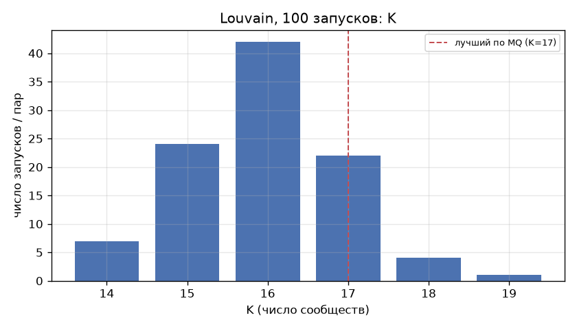
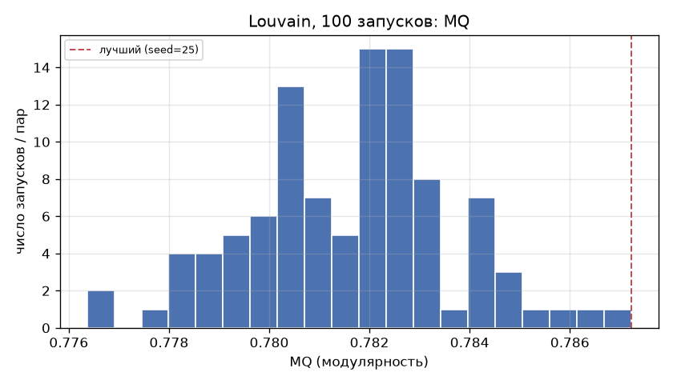
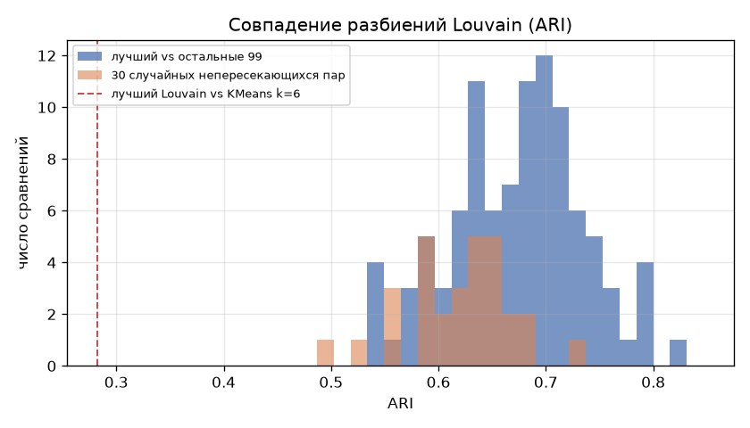

# 11b. Устойчивость Louvain (2024-12): 100 запусков

Сгенерировано `src/11b_louvain_stability.py`.

- Граф: `data/processed/economic_networks/2024-12_std_knn8.parquet` (2004 МО, 10,425 рёбер), вес = similarity; Louvain `networkx`, resolution = 1.0, seed = 0..99.
- Все запуски: `data/processed/louvain_runs_2024_12.parquet` (seed, K, MQ), метки — `data/processed/louvain_runs_labels_2024_12.parquet`.

## 1–2. Распределение K и MQ

|       |        K |       MQ |
|:------|---------:|---------:|
| count | 100.0000 | 100.0000 |
| mean  |  15.9500 |   0.7816 |
| std   |   0.9987 |   0.0020 |
| min   |  14.0000 |   0.7764 |
| 5%    |  14.0000 |   0.7784 |
| 25%   |  15.0000 |   0.7803 |
| 50%   |  16.0000 |   0.7819 |
| 75%   |  17.0000 |   0.7828 |
| 95%   |  17.0500 |   0.7849 |
| max   |  19.0000 |   0.7872 |

- K: min 14, max 19, медиана 16, мода 16
- MQ: min 0.7764, max 0.7872, медиана 0.7819 (размах 0.0109)

Частоты K:

|   K |   запусков |
|----:|-----------:|
|  14 |          7 |
|  15 |         24 |
|  16 |         42 |
|  17 |         22 |
|  18 |          4 |
|  19 |          1 |

### ARI между независимыми запусками (30 случайных непересекающихся пар, выбор пар — rng seed 2024)

|       |   ARI (случайные пары) |
|:------|-----------------------:|
| count |                 30.000 |
| mean  |                  0.619 |
| std   |                  0.049 |
| min   |                  0.491 |
| 5%    |                  0.541 |
| 25%   |                  0.591 |
| 50%   |                  0.629 |
| 75%   |                  0.646 |
| 95%   |                  0.678 |
| max   |                  0.727 |

## 3. Итоговое разбиение: лучший запуск по MQ

- **seed = 25** (сохранён в `data/processed/louvain_final_seed_2024_12.txt`); запусков с тем же максимальным MQ: 1
- метки: `data/processed/louvain_labels_2024_12.parquet` (заменяет прежнее разбиение seed = 42; оно сохранено как `louvain_labels_2024_12_seed42.parquet`)

## 5. Метрики итогового разбиения

|    seed |       K |     MQ |    AVI |    AVU |
|--------:|--------:|-------:|-------:|-------:|
| 25.0000 | 17.0000 | 0.7872 | 0.8424 | 0.5187 |

Формулы — `src/partition_metrics.py` без изменений. AVU нечувствителен к объёму межкластерных рёбер (см. `11_louvain_metrics.md`, раздел проверки) — интерпретировать как меру концентрации связей между парами кластеров.

|   cluster |   МО | топ-3 регионов                                                                             |   регионов |     E_int |       B |   Isolability |   Σ_l Unifiability(k,l) |
|----------:|-----:|:-------------------------------------------------------------------------------------------|-----------:|----------:|--------:|--------------:|------------------------:|
|         0 |  202 | Москва 104; Санкт-Петербург 80; Московская область 4                                       |         16 | 1,026.892 | 135.392 |         0.938 |                   0.522 |
|         1 |  193 | Московская область 39; Москва 34; Санкт-Петербург 18                                       |         46 |   904.296 | 185.071 |         0.907 |                   0.620 |
|         2 |  169 | Волгоградская область 25; Ставропольский край 18; Саратовская область 13                   |         35 |   727.078 | 210.827 |         0.873 |                   0.581 |
|         3 |  164 | Тверская область 20; Ивановская область 14; Смоленская область 10                          |         44 |   732.325 | 238.362 |         0.860 |                   0.609 |
|         4 |  156 | Республика Башкортостан 21; Кемеровская область 13; Свердловская область 10                |         46 |   729.936 | 190.623 |         0.885 |                   0.659 |
|         5 |  151 | Алтайский край 21; Удмуртская Республика 13; Нижегородская область 11                      |         31 |   625.878 | 236.812 |         0.841 |                   0.631 |
|         6 |  142 | Приморский край 14; Амурская область 13; Республика Саха (Якутия) 11                       |         34 |   584.211 | 173.787 |         0.871 |                   0.566 |
|         7 |  137 | Пермский край 10; Кировская область 9; Свердловская область 8                              |         37 |   558.940 | 258.279 |         0.812 |                   0.645 |
|         8 |  120 | Алтайский край 14; Кировская область 14; Пермский край 13                                  |         31 |   496.663 | 203.465 |         0.830 |                   0.560 |
|         9 |  111 | Саратовская область 14; Нижегородская область 11; Рязанская область 10                     |         30 |   461.846 | 185.853 |         0.832 |                   0.515 |
|        10 |   88 | Иркутская область 12; Республика Тыва 8; Республика Алтай 7                                |         30 |   365.559 | 149.334 |         0.830 |                   0.491 |
|        11 |   80 | Ханты-Мансийский автономный округ — Югра 13; Мурманская область 9; Ленинградская область 7 |         30 |   302.554 | 146.300 |         0.805 |                   0.478 |
|        12 |   70 | Костромская область 9; Алтайский край 8; Новосибирская область 7                           |         24 |   259.435 | 163.995 |         0.760 |                   0.471 |
|        13 |   68 | Республика Башкортостан 25; Республика Татарстан 9; Чувашская Республика 6                 |         19 |   244.180 | 114.903 |         0.810 |                   0.409 |
|        14 |   62 | Забайкальский край 8; Новосибирская область 8; Республика Татарстан 6                      |         18 |   241.486 |  99.275 |         0.829 |                   0.397 |
|        15 |   57 | Республика Саха (Якутия) 14; Забайкальский край 8; Сахалинская область 6                   |         18 |   225.797 |  96.522 |         0.824 |                   0.411 |
|        16 |   34 | Свердловская область 10; Оренбургская область 5; Челябинская область 4                     |         16 |   142.573 |  65.363 |         0.814 |                   0.255 |

## 4. Устойчивость итогового разбиения: ARI лучшего против остальных 99

|       |   ARI с лучшим |
|:------|---------------:|
| count |         99.000 |
| mean  |          0.674 |
| std   |          0.062 |
| min   |          0.539 |
| 5%    |          0.566 |
| 25%   |          0.633 |
| 50%   |          0.678 |
| 75%   |          0.714 |
| 95%   |          0.771 |
| max   |          0.827 |

- Медианный ARI с остальными запусками: **0.678** (межквартильный размах 0.633–0.714, min 0.539, max 0.827); запусков с ARI ≥ 0.8: 1%.
- Связь MQ запуска и его ARI с лучшим (Спирмен): +0.592.

**Ограничение метода.** Итоговое разбиение не воспроизводится независимыми запусками: типичный запуск совпадает с ним лишь на ARI ≈ 0.68, а независимые запуски между собой — на ARI ≈ 0.63. При этом MQ почти одинаков у всех запусков (размах 0.0109): у графа много разных разбиений почти равной модулярности (вырожденный ландшафт модулярности). Лучший запуск выше медианы по MQ лишь на 0.0053 (2.8 ст. откл.). Частично это смягчается тем, что запуски с более высоким MQ ближе к лучшему (Спирмен +0.59), — т. е. в области высокой модулярности разбиения сходятся, но даже ближайший запуск совпадает с лучшим не полностью (max ARI 0.83). Поэтому границы и число сообществ Louvain (K от 14 до 19) нельзя интерпретировать как устойчивую структуру на уровне отдельных МО; устойчивыми можно считать только крупные блоки, которые повторяются во всех запусках (проверить отдельно, например по матрице совместной встречаемости).

## 6. Сравнение с KMeans k = 6

- ARI(итоговый Louvain, KMeans k=6) = **0.282**; по всем 100 запускам Louvain: медиана 0.278, диапазон 0.229–0.317.
- ARI занижен разницей в числе кластеров (17 против 6): он штрафует и вложенные разбиения. Мера вложенности — доля МО, попавших в «основной» кластер KMeans своего сообщества Louvain (взвешенная чистота): **0.712**. То есть сообщества Louvain в основном — части кластеров KMeans, а не поперечное разбиение.

| разбиение                        |   K |     MQ |    AVI |    AVU |
|:---------------------------------|----:|-------:|-------:|-------:|
| Louvain, лучший по MQ (seed=25)  |  17 | 0.7872 | 0.8424 | 0.5187 |
| KMeans k=6 (kmeans_labels_final) |   6 | 0.6080 | 0.7737 | 0.5929 |

MQ, AVI, AVU для KMeans посчитаны на том же графе (как в шаге 11). Louvain оптимизирует модулярность прямо на графе, KMeans — евклидово расстояние в пространстве признаков, поэтому преимущество Louvain по MQ/AVI ожидаемо и не означает лучшую типологию само по себе.

Какому кластеру KMeans соответствует каждое сообщество Louvain:

|   сообщество Louvain |     МО |   основной кластер KMeans |   доля в нём |
|---------------------:|-------:|--------------------------:|-------------:|
|                 0.00 | 202.00 |                      3.00 |         0.95 |
|                 1.00 | 193.00 |                      1.00 |         0.54 |
|                 2.00 | 169.00 |                      2.00 |         0.87 |
|                 3.00 | 164.00 |                      0.00 |         0.95 |
|                 4.00 | 156.00 |                      1.00 |         0.71 |
|                 5.00 | 151.00 |                      5.00 |         0.64 |
|                 6.00 | 142.00 |                      4.00 |         0.46 |
|                 7.00 | 137.00 |                      0.00 |         0.76 |
|                 8.00 | 120.00 |                      5.00 |         0.95 |
|                 9.00 | 111.00 |                      2.00 |         0.77 |
|                10.00 |  88.00 |                      1.00 |         0.38 |
|                11.00 |  80.00 |                      0.00 |         0.49 |
|                12.00 |  70.00 |                      5.00 |         0.41 |
|                13.00 |  68.00 |                      1.00 |         0.74 |
|                14.00 |  62.00 |                      5.00 |         0.73 |
|                15.00 |  57.00 |                      4.00 |         0.53 |
|                16.00 |  34.00 |                      0.00 |         0.79 |

Таблица сопряжённости (строки — Louvain, столбцы — KMeans k=6):

|   Louvain |   0 |   1 |   2 |   3 |   4 |   5 |
|----------:|----:|----:|----:|----:|----:|----:|
|         0 |   0 |  10 |   0 | 192 |   0 |   0 |
|         1 |   0 | 105 |   4 |  84 |   0 |   0 |
|         2 |   5 |  15 | 147 |   0 |   0 |   2 |
|         3 | 155 |   0 |   4 |   0 |   0 |   5 |
|         4 |   0 | 110 |   0 |  42 |   3 |   1 |
|         5 |   0 |   1 |  54 |   0 |   0 |  96 |
|         6 |  15 |   5 |   0 |   0 |  66 |  56 |
|         7 | 104 |   0 |   0 |   0 |   0 |  33 |
|         8 |   5 |   0 |   0 |   0 |   1 | 114 |
|         9 |  23 |   0 |  85 |   0 |   0 |   3 |
|        10 |  22 |  33 |   0 |   0 |   4 |  29 |
|        11 |  39 |  36 |   3 |   0 |   2 |   0 |
|        12 |  16 |   0 |  25 |   0 |   0 |  29 |
|        13 |   0 |  50 |   7 |   1 |   0 |  10 |
|        14 |   0 |   7 |   5 |   0 |   5 |  45 |
|        15 |   0 |  24 |   0 |   0 |  30 |   3 |
|        16 |  27 |   0 |   0 |   0 |   0 |   7 |
