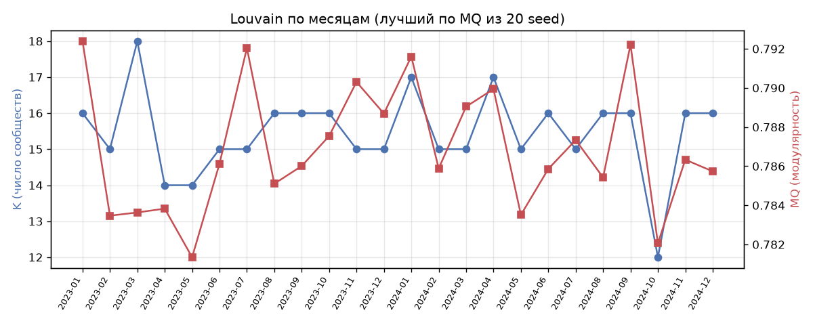

> **Историческая версия (канон KMeans k = 7), заменена 2026-09-28 решением перейти на k = 6.** Актуальная версия — файл без суффикса `_k7_superseded`.

# 13. Louvain по месяцам: облегчённая проверка и сравнение с KMeans k = 7

Сгенерировано `src/13_louvain_monthly_check.py`.

- Для каждого месяца: экономическая сеть `economic_networks/{YYYY-MM}_std_knn8.parquet`, Louvain 20 раз (seed 0..19), resolution = 1.0, вес — similarity; выбрано разбиение с максимальной MQ. Метки: `data/processed/louvain_monthly_labels.parquet`, сводка: `data/processed/louvain_monthly_summary.parquet`.
- KMeans — официальное разбиение месяца (min inertia из 100 запусков, шаг 12a) в согласованной нумерации (шаг 12).
- Вложенность: доля сообществ Louvain, у которых ≥ 80% МО из одного кластера KMeans (как задано), и взвешенная чистота — доля МО в «основном» кластере KMeans своего сообщества (метрика из 11b для декабря).
- Осознанно не делались: анализ устойчивости Louvain на 100 seed, co-occurrence, трекинг сообществ во времени (выполнены только для декабря 2024 — шаги 11b, 11c).

## K, MQ, AVI, AVU по месяцам

| месяц   |   seed |   K |     MQ |    AVI |    AVU |   MQ по 20 seed: min |   MQ по 20 seed: max |
|:--------|-------:|----:|-------:|-------:|-------:|---------------------:|---------------------:|
| 2023-01 |      9 |  16 | 0.7924 | 0.8510 | 0.5250 |               0.7843 |               0.7924 |
| 2023-02 |      2 |  15 | 0.7835 | 0.8459 | 0.5506 |               0.7760 |               0.7835 |
| 2023-03 |      7 |  18 | 0.7836 | 0.8384 | 0.5327 |               0.7767 |               0.7836 |
| 2023-04 |     12 |  14 | 0.7838 | 0.8558 | 0.5399 |               0.7782 |               0.7838 |
| 2023-05 |      1 |  14 | 0.7813 | 0.8496 | 0.5435 |               0.7742 |               0.7813 |
| 2023-06 |     18 |  15 | 0.7861 | 0.8518 | 0.5431 |               0.7769 |               0.7861 |
| 2023-07 |     10 |  15 | 0.7920 | 0.8601 | 0.5387 |               0.7855 |               0.7920 |
| 2023-08 |      6 |  16 | 0.7851 | 0.8523 | 0.5256 |               0.7780 |               0.7851 |
| 2023-09 |      6 |  16 | 0.7860 | 0.8481 | 0.5378 |               0.7801 |               0.7860 |
| 2023-10 |      9 |  16 | 0.7875 | 0.8501 | 0.5389 |               0.7813 |               0.7875 |
| 2023-11 |     15 |  15 | 0.7903 | 0.8569 | 0.5376 |               0.7810 |               0.7903 |
| 2023-12 |     15 |  15 | 0.7887 | 0.8538 | 0.5392 |               0.7824 |               0.7887 |
| 2024-01 |     11 |  17 | 0.7916 | 0.8478 | 0.5371 |               0.7877 |               0.7916 |
| 2024-02 |     19 |  15 | 0.7859 | 0.8541 | 0.5480 |               0.7756 |               0.7859 |
| 2024-03 |     13 |  15 | 0.7890 | 0.8526 | 0.5468 |               0.7815 |               0.7890 |
| 2024-04 |     15 |  17 | 0.7899 | 0.8464 | 0.5348 |               0.7792 |               0.7899 |
| 2024-05 |     19 |  15 | 0.7835 | 0.8493 | 0.5405 |               0.7733 |               0.7835 |
| 2024-06 |     15 |  16 | 0.7859 | 0.8495 | 0.5362 |               0.7795 |               0.7859 |
| 2024-07 |     17 |  15 | 0.7873 | 0.8557 | 0.5285 |               0.7808 |               0.7873 |
| 2024-08 |     17 |  16 | 0.7854 | 0.8481 | 0.5364 |               0.7790 |               0.7854 |
| 2024-09 |      3 |  16 | 0.7922 | 0.8555 | 0.5311 |               0.7830 |               0.7922 |
| 2024-10 |     16 |  12 | 0.7821 | 0.8638 | 0.5509 |               0.7708 |               0.7821 |
| 2024-11 |     17 |  16 | 0.7863 | 0.8494 | 0.5223 |               0.7791 |               0.7863 |
| 2024-12 |      7 |  16 | 0.7857 | 0.8476 | 0.5189 |               0.7764 |               0.7857 |

## Сравнение с KMeans k = 7 того же месяца

| месяц   |   K |   ARI с KMeans |   доля сообществ с чистотой ≥ 80% |   МО в сообществах с чистотой ≥ 80% |   взвешенная чистота |   кластеров KMeans, раздробленных на ≥ 2 сообщества (≥10% кластера) |
|:--------|----:|---------------:|----------------------------------:|------------------------------------:|---------------------:|--------------------------------------------------------------------:|
| 2023-01 |  16 |          0.276 |                             0.250 |                               0.262 |                0.685 |                                                                   7 |
| 2023-02 |  15 |          0.297 |                             0.333 |                               0.375 |                0.728 |                                                                   6 |
| 2023-03 |  18 |          0.273 |                             0.389 |                               0.421 |                0.734 |                                                                   7 |
| 2023-04 |  14 |          0.299 |                             0.214 |                               0.235 |                0.662 |                                                                   7 |
| 2023-05 |  14 |          0.324 |                             0.357 |                               0.363 |                0.676 |                                                                   6 |
| 2023-06 |  15 |          0.306 |                             0.333 |                               0.347 |                0.720 |                                                                   7 |
| 2023-07 |  15 |          0.328 |                             0.333 |                               0.290 |                0.722 |                                                                   7 |
| 2023-08 |  16 |          0.298 |                             0.312 |                               0.261 |                0.703 |                                                                   6 |
| 2023-09 |  16 |          0.298 |                             0.312 |                               0.288 |                0.709 |                                                                   7 |
| 2023-10 |  16 |          0.327 |                             0.375 |                               0.383 |                0.751 |                                                                   6 |
| 2023-11 |  15 |          0.278 |                             0.333 |                               0.315 |                0.681 |                                                                   7 |
| 2023-12 |  15 |          0.308 |                             0.400 |                               0.433 |                0.695 |                                                                   7 |
| 2024-01 |  17 |          0.298 |                             0.529 |                               0.561 |                0.729 |                                                                   5 |
| 2024-02 |  15 |          0.282 |                             0.333 |                               0.330 |                0.707 |                                                                   7 |
| 2024-03 |  15 |          0.280 |                             0.267 |                               0.271 |                0.692 |                                                                   6 |
| 2024-04 |  17 |          0.280 |                             0.176 |                               0.197 |                0.698 |                                                                   7 |
| 2024-05 |  15 |          0.300 |                             0.400 |                               0.410 |                0.687 |                                                                   7 |
| 2024-06 |  16 |          0.311 |                             0.438 |                               0.461 |                0.735 |                                                                   7 |
| 2024-07 |  15 |          0.332 |                             0.400 |                               0.392 |                0.696 |                                                                   7 |
| 2024-08 |  16 |          0.293 |                             0.250 |                               0.253 |                0.699 |                                                                   7 |
| 2024-09 |  16 |          0.272 |                             0.375 |                               0.386 |                0.709 |                                                                   7 |
| 2024-10 |  12 |          0.304 |                             0.250 |                               0.277 |                0.654 |                                                                   7 |
| 2024-11 |  16 |          0.294 |                             0.250 |                               0.332 |                0.701 |                                                                   6 |
| 2024-12 |  16 |          0.330 |                             0.188 |                               0.274 |                0.715 |                                                                   7 |

Сводно по 24 месяцам:

|      |      K |    MQ |   AVI |   AVU |   ARI с KMeans |   доля сообществ с чистотой ≥ 80% |   взвешенная чистота |
|:-----|-------:|------:|------:|------:|---------------:|----------------------------------:|---------------------:|
| mean | 15.458 | 0.787 | 0.851 | 0.537 |          0.299 |                             0.325 |                0.703 |
| std  |  1.179 | 0.003 | 0.005 | 0.008 |          0.019 |                             0.084 |                0.023 |
| min  | 12.000 | 0.781 | 0.838 | 0.519 |          0.272 |                             0.176 |                0.654 |
| 50%  | 15.500 | 0.786 | 0.851 | 0.538 |          0.298 |                             0.333 |                0.702 |
| max  | 18.000 | 0.792 | 0.864 | 0.551 |          0.332 |                             0.529 |                0.751 |

Справка — декабрь 2024 в разных вариантах (разница из-за числа seed Louvain и выбора разбиения KMeans):

| вариант                                                               |   ARI с KMeans |   доля сообществ с чистотой ≥ 80% |   МО в сообществах с чистотой ≥ 80% |   взвешенная чистота |   кластеров KMeans, раздробленных на ≥ 2 сообщества (≥10% кластера) |
|:----------------------------------------------------------------------|---------------:|----------------------------------:|------------------------------------:|---------------------:|--------------------------------------------------------------------:|
| 11b: Louvain seed 25 (лучший из 100) vs канонический KMeans (seed 42) |          0.325 |                             0.294 |                               0.358 |                0.734 |                                                                   7 |
| 11b: Louvain (лучший из 100) vs официальный KMeans (шаг 12a)          |          0.324 |                             0.294 |                               0.358 |                0.727 |                                                                   7 |
| этот шаг: Louvain (лучший из 20) vs официальный KMeans                |          0.330 |                             0.188 |                               0.274 |                0.715 |                                                                   7 |

## Вывод

- K: 12–18 (медиана 16); MQ: 0.781–0.792. ARI Louvain–KMeans: 0.272–0.332 (медиана 0.298); взвешенная чистота: 0.654–0.751 (медиана 0.702); доля сообществ с чистотой ≥ 80%: 0.18–0.53 (медиана 0.33).
- Декабрь 2024 среди 24 месяцев: 23-й по наименьшему ARI и 8-й по наибольшей взвешенной чистоте.
- Отклонение декабря от среднего по месяцам (в ст. откл.): ARI с KMeans +1.6, взвешенная чистота +0.5, доля сообществ с чистотой ≥ 80% -1.6, K +0.5.
- Разброс по месяцам мал: ст. откл. ARI 0.019, взвешенной чистоты 0.023.

**Картина декабря типична для всего периода, а не особенность декабря.** Во всех 24 месяцах Louvain даёт более дробное разбиение (K ≈ 16 против 7), которое слабо совпадает с KMeans по ARI (≈ 0.30), но в основном вложено в его кластеры: ≈ 70% МО находятся в «основном» кластере KMeans своего сообщества. Вложенность при этом **частичная**: строгому критерию (≥ 80% МО из одного кластера) отвечает лишь около 33% сообществ. Остальные в основном стыкуют два типа KMeans: у 84% из 250 таких сообществ (все месяцы) ≥ 80% МО приходятся на два кластера KMeans. Итоговая формулировка для всего периода: сообщества Louvain в основном — части типов KMeans или стыки двух соседних типов, а не поперечное деление; это свойство сочетания методов, а не особенность декабря.
