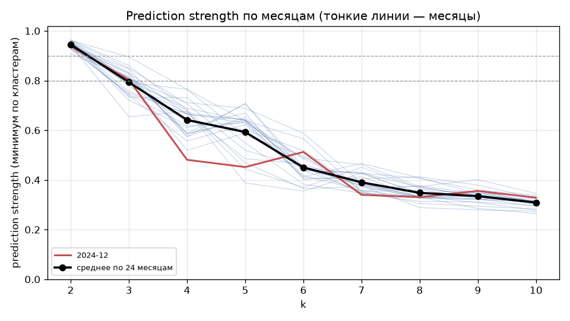

# 14. Проверки устойчивости выбора k

Сгенерировано `src/14_robustness_report.py` по результатам `src/14a_feature_spec_check.py` и `src/14b_k_over_time.py`. Предыдущие отчёты не изменялись; канон не менялся.

> **СТОП: проверка 2 противоречит части обоснования k = 6.** Максимум prediction strength среди k ≥ 4 приходится на k = 6 только в **1 из 24** месяцев (2024-12); в остальных — k = 4 (14 мес.) или k = 5 (9 мес.). Средний PS по месяцам: k = 4 — 0.642, k = 5 — 0.593, k = 6 — 0.450, k = 7 — 0.390. 2024-12 нетипичен именно для малых k: его PS при k = 4 и 5 ниже среднего по месяцам на 2.2 и 1.6 ст. откл. Утверждение 10c «k = 6 лучше всех k ≥ 4» верно только для 2024-12. Сравнение k = 6 vs k = 7 в основном держится: PS(6) > PS(7) в 19 из 24 месяцев (значимо — в 14), но в 3 месяцах значимо лучше k = 7. По правилу батча проверки 4 и 5 не выполнялись; канон не изменён — решение за автором.

## Сводка

| проверка                             | результат                                                                                                                                                    | подтверждает k = 6?                                          | дополнительно                                           |
|:-------------------------------------|:-------------------------------------------------------------------------------------------------------------------------------------------------------------|:-------------------------------------------------------------|:--------------------------------------------------------|
| 1. Спецификация признаков (A/B/C)    | PS(k=6) > PS(k=7) во всех вариантах (разница 13.1, 3.4, 7.8 SE); но разбиение k = 6 меняется: ARI с каноном 0.40, 0.53 (B, C), в другом кластере 44%, 26% МО | да — выбор k                                                 | **нет** — состав типов чувствителен к определению долей |
| 2. Выбор k во времени (24 мес., PS)  | k = 6 — максимум PS среди k ≥ 4 в 1 из 24 месяцев (2024-12); в остальных — k = 4 или 5. PS(6) > PS(7) в 19 из 24 (> 2 SE — в 14; обратное значимо — в 3)     | **нет** — «k = 6 лучше всех k ≥ 4» верно только для 2024-12  | да, в большинстве месяцев — «k = 6 лучше k = 7»         |
| 2. SW и S_Dbw norm во времени        | среди k ≥ 4 SW максимален при k = 4 во всех 24 месяцах; S_Dbw norm минимален при k = 4 в 19                                                                  | нет (смещены к малым k, как и ожидалось)                     | —                                                       |
| 3. Агрегация PS (минимум vs среднее) | 2024-12: по среднему по кластерам максимум среди k = 4–8 — k = 6; по месяцам PS(6) > PS(7) по среднему — в 16 из 24 (значимо — 14, обратное — 5)             | да для 6 vs 7; не зависит от агрегации по минимуму в 2024-12 | —                                                       |
| 4. Louvain: resolution, kNN          | не выполнялось — остановлено по правилу батча                                                                                                                | —                                                            | —                                                       |
| 5. Gap statistic                     | не выполнялось — остановлено по правилу батча                                                                                                                | —                                                            | —                                                       |

## 1. Чувствительность к спецификации признаков (декабрь 2024)

A — 5 долей от «Все категории» (текущий); B — 5 долей, нормированных к сумме пяти; C — 5 долей + share_Прочее. Во всех вариантах z-score внутри месяца; KMeans — лучший по inertia из 100 запусков; ARI и доля МО в другом кластере — относительно `kmeans_labels_final`; сеть — z-score + cosine + kNN8.

| вариант                              |   признаков |   ARI с каноном |   доля МО в другом кластере |   Жаккар рёбер сети с текущей |   PS k=6 |   PS k=7 |   разница |   разница / SE |
|:-------------------------------------|------------:|----------------:|----------------------------:|------------------------------:|---------:|---------:|----------:|---------------:|
| A: 5 долей от «Все категории»        |           5 |           0.961 |                       0.015 |                         1.000 |    0.513 |    0.340 |     0.173 |         13.069 |
| B: 5 долей, нормированы к сумме пяти |           5 |           0.398 |                       0.443 |                         0.348 |    0.467 |    0.428 |     0.039 |          3.398 |
| C: 5 долей + share_Прочее            |           6 |           0.527 |                       0.262 |                         0.677 |    0.468 |    0.383 |     0.086 |          7.783 |

- Предпочтение k = 6 над k = 7 по PS сохраняется во всех вариантах, хотя в B разница меньше (+0.039).
- **Сам состав кластеров k = 6 сильно зависит от определения долей:** при нормировке к сумме пяти (B) ARI с каноном 0.40, в другом кластере 44% МО; экономическая сеть совпадает с текущей лишь на 35% рёбер. Доля «прочих» расходов (не входящих в 5 категорий) — самостоятельная ось различий между МО; выбор знаменателя долей меняет, что считается «похожими» МО.

## 2. Выбор k во времени (24 месяца, k = 2..10)

| агрегация PS                    |   PS(6) > PS(7) |   больше чем на 2 SE |   PS(7) > PS(6) больше чем на 2 SE |
|:--------------------------------|----------------:|---------------------:|-----------------------------------:|
| минимум по кластерам (стандарт) |              19 |                   14 |                                  3 |
| среднее по кластерам            |              16 |                   14 |                                  5 |

Средние по месяцам:

|      k |   PS (минимум), среднее по месяцам |   PS (среднее по кластерам), среднее по месяцам |   SW, среднее |   S_Dbw norm, среднее |
|-------:|-----------------------------------:|------------------------------------------------:|--------------:|----------------------:|
|  2.000 |                              0.945 |                                           0.972 |         0.385 |                -9.311 |
|  3.000 |                              0.793 |                                           0.885 |         0.262 |                -9.035 |
|  4.000 |                              0.642 |                                           0.778 |         0.240 |                -8.625 |
|  5.000 |                              0.593 |                                           0.770 |         0.228 |                -7.215 |
|  6.000 |                              0.450 |                                           0.684 |         0.226 |                -6.780 |
|  7.000 |                              0.390 |                                           0.652 |         0.221 |                -6.409 |
|  8.000 |                              0.348 |                                           0.611 |         0.211 |                -6.508 |
|  9.000 |                              0.335 |                                           0.601 |         0.205 |                -6.719 |
| 10.000 |                              0.309 |                                           0.578 |         0.204 |                -6.964 |

По месяцам:

| месяц   |   PS k=6 |   PS k=7 |   разница / SE |   k с макс. PS (k ≥ 4) |   k с макс. SW (k ≥ 4) |   k с мин. S_Dbw norm (k ≥ 4) |
|:--------|---------:|---------:|---------------:|-----------------------:|-----------------------:|------------------------------:|
| 2023-01 |    0.370 |    0.451 |         -5.878 |                      4 |                      4 |                             4 |
| 2023-02 |    0.355 |    0.428 |         -5.220 |                      4 |                      4 |                             4 |
| 2023-03 |    0.488 |    0.461 |          1.570 |                      5 |                      4 |                            10 |
| 2023-04 |    0.438 |    0.427 |          0.755 |                      4 |                      4 |                             7 |
| 2023-05 |    0.408 |    0.405 |          0.271 |                      4 |                      4 |                             4 |
| 2023-06 |    0.453 |    0.375 |          6.505 |                      5 |                      4 |                             4 |
| 2023-07 |    0.588 |    0.387 |         13.457 |                      4 |                      4 |                             4 |
| 2023-08 |    0.438 |    0.354 |          7.007 |                      5 |                      4 |                             4 |
| 2023-09 |    0.437 |    0.431 |          0.473 |                      5 |                      4 |                             4 |
| 2023-10 |    0.452 |    0.425 |          1.773 |                      5 |                      4 |                             4 |
| 2023-11 |    0.463 |    0.386 |          5.800 |                      4 |                      4 |                             4 |
| 2023-12 |    0.454 |    0.379 |          6.451 |                      4 |                      4 |                             4 |
| 2024-01 |    0.413 |    0.467 |         -5.306 |                      5 |                      4 |                             4 |
| 2024-02 |    0.402 |    0.412 |         -0.812 |                      5 |                      4 |                             4 |
| 2024-03 |    0.486 |    0.381 |          7.013 |                      5 |                      4 |                             4 |
| 2024-04 |    0.497 |    0.347 |         11.070 |                      4 |                      4 |                             4 |
| 2024-05 |    0.565 |    0.352 |         14.873 |                      4 |                      4 |                             5 |
| 2024-06 |    0.418 |    0.358 |          5.496 |                      4 |                      4 |                             4 |
| 2024-07 |    0.447 |    0.376 |          5.343 |                      4 |                      4 |                             4 |
| 2024-08 |    0.365 |    0.373 |         -0.620 |                      4 |                      4 |                             4 |
| 2024-09 |    0.452 |    0.348 |          7.387 |                      5 |                      4 |                            10 |
| 2024-10 |    0.518 |    0.358 |         10.650 |                      4 |                      4 |                             4 |
| 2024-11 |    0.383 |    0.346 |          3.435 |                      4 |                      4 |                             5 |
| 2024-12 |    0.513 |    0.340 |         13.069 |                      6 |                      4 |                             4 |

## 3. Разложение prediction strength (2024-12, k = 4–8)

|   k |   PS (минимум) |   PS (среднее по кластерам) | доли пар по кластерам (средние, по возрастанию)   |
|----:|---------------:|----------------------------:|:--------------------------------------------------|
|   4 |          0.481 |                       0.645 | 0.61, 0.63, 0.63, 0.71                            |
|   5 |          0.452 |                       0.688 | 0.65, 0.67, 0.68, 0.70, 0.74                      |
|   6 |          0.513 |                       0.728 | 0.68, 0.70, 0.71, 0.73, 0.73, 0.81                |
|   7 |          0.340 |                       0.619 | 0.59, 0.59, 0.61, 0.62, 0.62, 0.63, 0.68          |
|   8 |          0.330 |                       0.605 | 0.58, 0.59, 0.59, 0.61, 0.61, 0.62, 0.62, 0.63    |

- В 2024-12 предпочтение k = 6 не зависит от агрегации по минимуму: по среднему по кластерам k = 6 тоже максимален среди k = 4–8 (0.728).
- По всем месяцам агрегация влияет слабо: по среднему по кластерам PS(6) > PS(7) в 16 из 24 месяцев против 19 по минимуму. По среднему по кластерам PS тоже убывает с k (среднее по месяцам: k = 4 — 0.778, k = 6 — 0.684).

## 4–5. Не выполнялись

Louvain при разных resolution и kNN, gap statistic — остановлено по правилу батча после противоречия в проверке 2.
