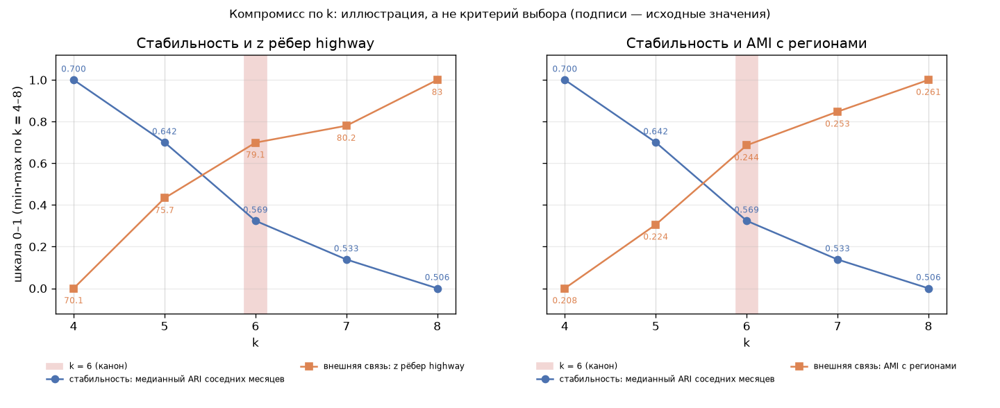

# 15e. Внешняя валидность вариантов признаков и выбора k

Сгенерировано `src/15e_external_validity.py`. Решение не принимается; канон, 10c, README и прежние отчёты не изменялись.

Внешние данные, не входившие в признаки: log(market_access); region_code (справочник МО); граф highway kNN8 (шаг 07). z-оценка — против 200 перестановок меток (размеры кластеров сохраняются). Сравнения — парный критерий Уилкоксона по 24 месяцам, α = 0.05.

> Сравнение между k имеет ограничение: с ростом k R² растёт механически (скорректированный R² и ω² это частично учитывают), а доля рёбер внутри кластеров падает (z-оценка против перестановок с теми же размерами кластеров это учитывает); AMI скорректирован на случайность. Месяцы не независимы, поэтому p-значения критерия Уилкоксона ориентировочные.

Показатели: **adj R² log(MA)** — скорректированный R² для log(market_access); **ω² log(MA)** — ω² для log(market_access); **AMI регион** — AMI кластеров и region_code; **доля рёбер highway внутри** — доля рёбер highway kNN8 внутри кластеров; **z рёбер highway** — z-оценка доли рёбер highway внутри кластеров против перестановок. Для всех показателей больше — значит сильнее связь кластеров с внешними данными.

## Варианты признаков A/B/C при k = 6

| разбиение   |   adj R² log(MA): 2024-12 | adj R² log(MA): среднее ± ст. откл.   |   ω² log(MA): 2024-12 | ω² log(MA): среднее ± ст. откл.   |   AMI регион: 2024-12 | AMI регион: среднее ± ст. откл.   |   доля рёбер highway внутри: 2024-12 | доля рёбер highway внутри: среднее ± ст. откл.   |   z рёбер highway: 2024-12 | z рёбер highway: среднее ± ст. откл.   |
|:------------|--------------------------:|:--------------------------------------|----------------------:|:----------------------------------|----------------------:|:----------------------------------|-------------------------------------:|:-------------------------------------------------|---------------------------:|:---------------------------------------|
| A           |                     0.474 | 0.401 ± 0.047                         |                 0.474 | 0.401 ± 0.047                     |                 0.243 | 0.244 ± 0.009                     |                                0.485 | 0.482 ± 0.015                                    |                     76.580 | 79.132 ± 4.665                         |
| B           |                     0.461 | 0.393 ± 0.026                         |                 0.461 | 0.392 ± 0.026                     |                 0.225 | 0.234 ± 0.016                     |                                0.485 | 0.464 ± 0.026                                    |                     69.248 | 74.883 ± 9.032                         |
| C           |                     0.483 | 0.417 ± 0.052                         |                 0.483 | 0.417 ± 0.052                     |                 0.241 | 0.243 ± 0.013                     |                                0.481 | 0.476 ± 0.021                                    |                     76.624 | 78.925 ± 6.288                         |

Лидер по среднему за 24 месяца:

| показатель                | максимум среднего по 24 мес. у   |   значение |
|:--------------------------|:---------------------------------|-----------:|
| adj R² log(MA)            | C                                |      0.417 |
| ω² log(MA)                | C                                |      0.417 |
| AMI регион                | A                                |      0.244 |
| доля рёбер highway внутри | A                                |      0.482 |
| z рёбер highway           | A                                |     79.132 |

Парные сравнения:

| сравнение   | показатель                |   медиана разницы |   A выше (мес.) |   p (Уилкоксон) | значимо (p < 0.05)   | выше у   |   B выше (мес.) |
|:------------|:--------------------------|------------------:|----------------:|----------------:|:---------------------|:---------|----------------:|
| A vs B      | adj R² log(MA)            |          0.01389  |              15 |       0.2405    | нет                  | —        |             nan |
| A vs B      | ω² log(MA)                |          0.01389  |              15 |       0.2405    | нет                  | —        |             nan |
| A vs B      | AMI регион                |          0.0124   |              20 |       0.0014    | да                   | A        |             nan |
| A vs B      | доля рёбер highway внутри |          0.02183  |              21 |       0.0004299 | да                   | A        |             nan |
| A vs B      | z рёбер highway           |          6.611    |              16 |       0.01504   | да                   | A        |             nan |
| A vs C      | adj R² log(MA)            |         -0.008677 |               9 |       0.1208    | нет                  | —        |             nan |
| A vs C      | ω² log(MA)                |         -0.008677 |               9 |       0.1208    | нет                  | —        |             nan |
| A vs C      | AMI регион                |          0.002921 |              15 |       0.4732    | нет                  | —        |             nan |
| A vs C      | доля рёбер highway внутри |          0.01077  |              15 |       0.0951    | нет                  | —        |             nan |
| A vs C      | z рёбер highway           |          0.1948   |              12 |       0.9441    | нет                  | —        |             nan |
| B vs C      | adj R² log(MA)            |         -0.03219  |             nan |       0.02293   | да                   | C        |               4 |
| B vs C      | ω² log(MA)                |         -0.03219  |             nan |       0.02293   | да                   | C        |               4 |
| B vs C      | AMI регион                |         -0.01165  |             nan |       0.002246  | да                   | C        |               4 |
| B vs C      | доля рёбер highway внутри |         -0.01542  |             nan |       0.01771   | да                   | C        |               6 |
| B vs C      | z рёбер highway           |         -6.152    |             nan |       0.02486   | да                   | C        |               6 |

## Вариант A при k = 4–8

| разбиение   |   adj R² log(MA): 2024-12 | adj R² log(MA): среднее ± ст. откл.   |   ω² log(MA): 2024-12 | ω² log(MA): среднее ± ст. откл.   |   AMI регион: 2024-12 | AMI регион: среднее ± ст. откл.   |   доля рёбер highway внутри: 2024-12 | доля рёбер highway внутри: среднее ± ст. откл.   |   z рёбер highway: 2024-12 | z рёбер highway: среднее ± ст. откл.   |
|:------------|--------------------------:|:--------------------------------------|----------------------:|:----------------------------------|----------------------:|:----------------------------------|-------------------------------------:|:-------------------------------------------------|---------------------------:|:---------------------------------------|
| k=4         |                     0.324 | 0.322 ± 0.021                         |                 0.324 | 0.322 ± 0.021                     |                 0.200 | 0.208 ± 0.011                     |                                0.544 | 0.562 ± 0.017                                    |                     67.387 | 70.067 ± 5.871                         |
| k=5         |                     0.393 | 0.343 ± 0.022                         |                 0.393 | 0.343 ± 0.022                     |                 0.220 | 0.224 ± 0.011                     |                                0.489 | 0.505 ± 0.025                                    |                     71.022 | 75.681 ± 7.103                         |
| k=6         |                     0.474 | 0.401 ± 0.047                         |                 0.474 | 0.401 ± 0.047                     |                 0.243 | 0.244 ± 0.009                     |                                0.485 | 0.482 ± 0.015                                    |                     76.580 | 79.132 ± 4.665                         |
| k=7         |                     0.504 | 0.427 ± 0.040                         |                 0.504 | 0.427 ± 0.040                     |                 0.257 | 0.253 ± 0.010                     |                                0.464 | 0.452 ± 0.019                                    |                     81.214 | 80.184 ± 5.135                         |
| k=8         |                     0.506 | 0.455 ± 0.038                         |                 0.506 | 0.455 ± 0.038                     |                 0.256 | 0.261 ± 0.010                     |                                0.420 | 0.425 ± 0.016                                    |                     77.797 | 83.034 ± 4.602                         |

Лидер по среднему за 24 месяца:

| показатель                | максимум среднего по 24 мес. у   |   значение |
|:--------------------------|:---------------------------------|-----------:|
| adj R² log(MA)            | k=8                              |      0.455 |
| ω² log(MA)                | k=8                              |      0.455 |
| AMI регион                | k=8                              |      0.261 |
| доля рёбер highway внутри | k=4                              |      0.562 |
| z рёбер highway           | k=8                              |     83.034 |

Парные сравнения k = 6 с остальными:

| сравнение   | показатель                |   медиана разницы |   k=6 выше (мес.) |   p (Уилкоксон) | значимо (p < 0.05)   | выше у   |
|:------------|:--------------------------|------------------:|------------------:|----------------:|:---------------------|:---------|
| k=6 vs k=4  | adj R² log(MA)            |          0.08277  |                23 |       2.384e-07 | да                   | k=6      |
| k=6 vs k=4  | ω² log(MA)                |          0.08276  |                23 |       2.384e-07 | да                   | k=6      |
| k=6 vs k=4  | AMI регион                |          0.03559  |                24 |       1.192e-07 | да                   | k=6      |
| k=6 vs k=4  | доля рёбер highway внутри |         -0.08071  |                 0 |       1.192e-07 | да                   | k=4      |
| k=6 vs k=4  | z рёбер highway           |          8.74     |                23 |       3.576e-07 | да                   | k=6      |
| k=6 vs k=5  | adj R² log(MA)            |          0.05956  |                23 |       2.384e-07 | да                   | k=6      |
| k=6 vs k=5  | ω² log(MA)                |          0.05955  |                23 |       2.384e-07 | да                   | k=6      |
| k=6 vs k=5  | AMI регион                |          0.02165  |                24 |       1.192e-07 | да                   | k=6      |
| k=6 vs k=5  | доля рёбер highway внутри |         -0.02178  |                 1 |       8.345e-07 | да                   | k=5      |
| k=6 vs k=5  | z рёбер highway           |          1.568    |                17 |       0.01378   | да                   | k=6      |
| k=6 vs k=7  | adj R² log(MA)            |         -0.01721  |                 6 |       0.0004299 | да                   | k=7      |
| k=6 vs k=7  | ω² log(MA)                |         -0.01721  |                 6 |       0.0004299 | да                   | k=7      |
| k=6 vs k=7  | AMI регион                |         -0.007251 |                 0 |       1.192e-07 | да                   | k=7      |
| k=6 vs k=7  | доля рёбер highway внутри |          0.03154  |                23 |       2.384e-07 | да                   | k=6      |
| k=6 vs k=7  | z рёбер highway           |         -0.9438   |                 9 |       0.16      | нет                  | —        |
| k=6 vs k=8  | adj R² log(MA)            |         -0.03953  |                 0 |       1.192e-07 | да                   | k=8      |
| k=6 vs k=8  | ω² log(MA)                |         -0.03953  |                 0 |       1.192e-07 | да                   | k=8      |
| k=6 vs k=8  | AMI регион                |         -0.0156   |                 0 |       1.192e-07 | да                   | k=8      |
| k=6 vs k=8  | доля рёбер highway внутри |          0.05703  |                24 |       1.192e-07 | да                   | k=6      |
| k=6 vs k=8  | z рёбер highway           |         -4.802    |                 4 |       0.0002393 | да                   | k=8      |

<!-- 15f:start -->
## Компромисс по k (иллюстрация)

Сгенерировано `src/15f_k_tradeoff.py`. Вариант A, k = 4–8. Стабильность — медианный ARI разбиений соседних месяцев (шаг 12); внешняя связь — среднее по 24 месяцам z рёбер highway или AMI с регионами (таблицы выше). Каждая кривая приведена к шкале 0–1 min-max по k.

|     k |   медианный ARI соседних месяцев |   стабильность (0–1) |   z рёбер highway, среднее |   z рёбер highway (0–1) |   AMI регион, среднее |   AMI регион (0–1) |
|------:|---------------------------------:|---------------------:|---------------------------:|------------------------:|----------------------:|-------------------:|
| 4.000 |                            0.700 |                1.000 |                     70.067 |                   0.000 |                 0.208 |              0.000 |
| 5.000 |                            0.642 |                0.700 |                     75.681 |                   0.433 |                 0.224 |              0.306 |
| 6.000 |                            0.569 |                0.324 |                     79.132 |                   0.699 |                 0.244 |              0.686 |
| 7.000 |                            0.533 |                0.138 |                     80.184 |                   0.780 |                 0.253 |              0.848 |
| 8.000 |                            0.506 |                0.000 |                     83.034 |                   1.000 |                 0.261 |              1.000 |

**Как читать.** Это иллюстрация компромисса, а не критерий выбора k. С ростом k разбиения соседних месяцев совпадают хуже, а связь кластеров с внешними данными (регион, транспортная близость) усиливается — отчасти механически, из-за большего числа групп. Шкалы 0–1 построены по диапазону k = 4–8 и произвольны: положение точки пересечения кривых и «расстояния» между ними зависят от выбранного диапазона и нормировки и сами по себе не указывают на оптимальное k. На рисунке видно лишь, что k = 6 находится внутри этого компромисса, а не на одном из его краёв.
<!-- 15f:end -->
