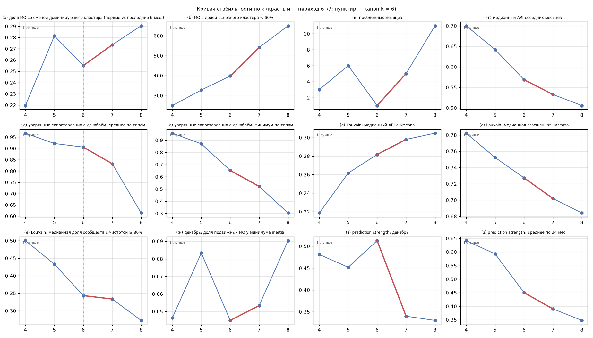

# 16. Кривая стабильности по k = 4–8

**Есть ли излом на 6→7 хотя бы в двух метриках из (а)–(з)? — НЕТ.** Излом (|Δ 6→7| ≥ 1.5 × max соседних переходов 5→6 и 7→8) найден в 1 из 8 метрик: (з) prediction strength: декабрь (хуже). Остальные метрики меняются на 6→7 гладко, в пределах соседних переходов.

**Где k = 6 — локальный оптимум (лучше и k = 5, и k = 7):** 3 из 11 показателей — (а) доля МО со сменой доминирующего кластера (первые vs последние 6 мес.); (ж) декабрь: доля подвижных МО у минимума inertia; (з) prediction strength: декабрь. В этих показателях заметный скачок приходится на 5→6 (k = 5 хуже обоих соседей), а не на 6→7. Показатель (в) проблемных месяцев в подсчёт не входит: критерий проблемного месяца (≥ 2 неоднозначных сопоставлений с якорем или доля МО, сменивших кластер, выше Q3 + 1.5·IQR своего ряда) зависит от геометрии разбиения и якоря и между k напрямую не сопоставляется — так же, как между вариантами признаков A/B/C (отчёт 15).

Близко к порогу излома (отношение ≥ 1, но < KINK_RATIO): (б) МО с долей основного кластера < 60%: |Δ 6→7| / max соседних = 1.31; (е) Louvain: медианная взвешенная чистота: |Δ 6→7| / max соседних = 1.02.

Сгенерировано `src/16_k_stability_curve.py`. Для всех k — один и тот же код и одни и те же официальные разбиения: шаги 12a/12 (`--k`), 10b (профили и якорная нумерация), функция вложенности шага 13 (Louvain-разбиения по месяцам общие для всех k), функция плоского минимума шага 10c, prediction strength — шаг 14b. Канон не менялся.

Правило излома (config.KINK_RATIO = 1.5): |Δ(6→7)| ≥ 1.5 · max(|Δ(5→6)|, |Δ(7→8)|). «Лучше/хуже» — с учётом ориентации показателя.

|    | показатель                                                            | ориентация   |     k=4 |   Δ 4→5 |     k=5 |   Δ 5→6 |     k=6 |   Δ 6→7 |     k=7 |   Δ 7→8 |     k=8 | k=6 лучше и k=5, и k=7   | 6→7 относительно соседних                          |
|:---|:----------------------------------------------------------------------|:-------------|--------:|--------:|--------:|--------:|--------:|--------:|--------:|--------:|--------:|:-------------------------|:---------------------------------------------------|
| а  | доля МО со сменой доминирующего кластера (первые vs последние 6 мес.) | ↓ лучше      |   0.220 |   0.062 |   0.281 |  -0.026 |   0.255 |   0.018 |   0.273 |   0.017 |   0.290 | да                       | гладко (0.0185 vs max соседних 0.0264)             |
| б  | МО с долей основного кластера < 60%                                   | ↓ лучше      | 250.000 |  78.000 | 328.000 |  70.000 | 398.000 | 143.000 | 541.000 | 109.000 | 650.000 |                          | гладко (143 vs max соседних 109)                   |
| в  | проблемных месяцев                                                    | ↓ лучше      |   3.000 |   3.000 |   6.000 |  -5.000 |   1.000 |   4.000 |   5.000 |   6.000 |  11.000 | да, не учитывается¹      | гладко (4 vs max соседних 6)                       |
| г  | медианный ARI соседних месяцев                                        | ↑ лучше      |   0.700 |  -0.058 |   0.642 |  -0.073 |   0.569 |  -0.036 |   0.533 |  -0.027 |   0.506 |                          | гладко (0.0361 vs max соседних 0.0731)             |
| д  | уверенные сопоставления с декабрём: среднее по типам                  | ↑ лучше      |   0.967 |  -0.046 |   0.922 |  -0.016 |   0.906 |  -0.073 |   0.832 |  -0.218 |   0.614 |                          | гладко (0.0735 vs max соседних 0.218)              |
| д  | уверенные сопоставления с декабрём: минимум по типам                  | ↑ лучше      |   0.957 |  -0.087 |   0.870 |  -0.217 |   0.652 |  -0.130 |   0.522 |  -0.217 |   0.304 |                          | гладко (0.13 vs max соседних 0.217)                |
| е  | Louvain: медианный ARI с KMeans                                       | ↑ лучше      |   0.219 |   0.043 |   0.262 |   0.020 |   0.282 |   0.016 |   0.298 |   0.007 |   0.305 |                          | гладко (0.0163 vs max соседних 0.0201)             |
| е  | Louvain: медианная взвешенная чистота                                 | ↑ лучше      |   0.782 |  -0.030 |   0.752 |  -0.025 |   0.727 |  -0.025 |   0.702 |  -0.018 |   0.684 |                          | гладко (0.0254 vs max соседних 0.025)              |
| е  | Louvain: медианная доля сообществ с чистотой ≥ 80%                    | ↑ лучше      |   0.500 |  -0.067 |   0.433 |  -0.090 |   0.343 |  -0.010 |   0.333 |  -0.061 |   0.272 |                          | гладко (0.0098 vs max соседних 0.0899)             |
| ж  | декабрь: доля подвижных МО у минимума inertia                         | ↓ лучше      |   0.046 |   0.037 |   0.083 |  -0.038 |   0.045 |   0.008 |   0.053 |   0.037 |   0.090 | да                       | гладко (0.00848 vs max соседних 0.0384)            |
| з  | prediction strength: декабрь                                          | ↑ лучше      |   0.481 |  -0.029 |   0.452 |   0.061 |   0.513 |  -0.173 |   0.340 |  -0.010 |   0.330 | да                       | **излом**: 6→7 хуже (0.173 vs max соседних 0.0608) |
| з  | prediction strength: среднее по 24 мес.                               | ↑ лучше      |   0.642 |  -0.049 |   0.593 |  -0.143 |   0.450 |  -0.060 |   0.390 |  -0.042 |   0.348 |                          | гладко (0.0599 vs max соседних 0.143)              |

¹ (в) проблемных месяцев: критерий проблемного месяца (≥ 2 неоднозначных сопоставлений с якорем или доля МО, сменивших кластер, выше Q3 + 1.5·IQR своего ряда) зависит от геометрии разбиения и якоря и между k напрямую не сопоставляется — так же, как между вариантами признаков A/B/C (отчёт 15). В подсчёт «k = 6 — локальный оптимум» не входит.
